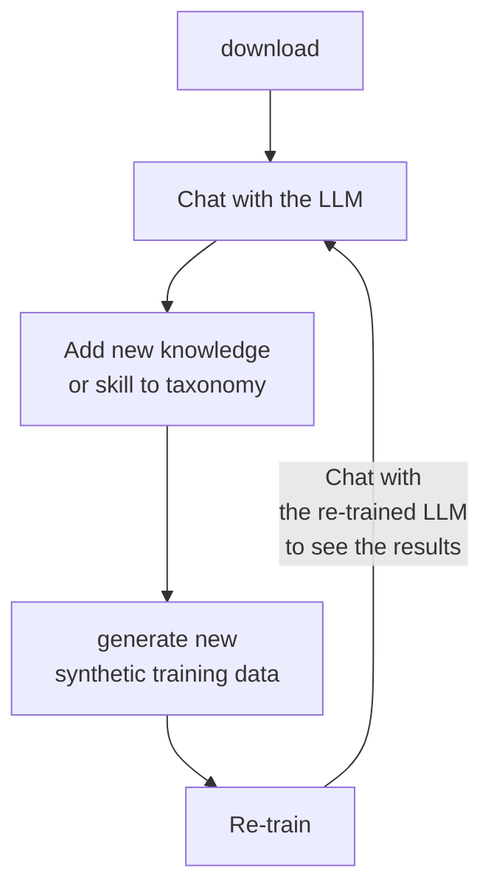

# InstructLab 🐶 (`ilab`)


## 📖 Contents

- [Welcome to the InstructLab CLI](#welcome-to-the-instructlab-cli)
- [🎺 What's New](#-whats-new)
- [❓ What is `ilab`](#-what-is-ilab)
- [📋 Requirements](#-requirements)
- [✅ Getting started](#-getting-started)
  - [🧰 Installing `ilab`](#-installing-ilab)
    - [Install with no GPU acceleration and PyTorch without CUDA bindings](#install-using-pytorch-without-cuda-bindings-and-no-gpu-acceleration)
    - [Install with AMD ROCm](#install-with-amd-rocm)
    - [Install with Apple Metal on M1/M2/M3 Macs](#install-with-apple-metal-on-m1m2m3-macs)
    - [Install with Nvidia CUDA](#install-with-nvidia-cuda)
  - [🏗️ Initialize `ilab`](#️-initialize-ilab)
  - [📥 Download the model](#-download-the-model)
  - [🍴 Serving the model](#-serving-the-model)
  - [📣 Chat with the model (Optional)](#-chat-with-the-model-optional)
- [💻 Creating new knowledge or skills and training the model](#-creating-new-knowledge-or-skills-and-training-the-model)
  - [🎁 Contribute knowledge or compositional skills](#-contribute-knowledge-or-compositional-skills)
  - [📜 List and validate your new data](#-list-and-validate-your-new-data)
  - [🚀 Generate a synthetic dataset](#-generate-a-synthetic-dataset)
  - [👩‍🏫 Training the model](#-training-the-model)
    - [Train the model locally on Linux](#train-the-model-locally-on-linux)
    - [Train the model locally on M-series Macs](#train-the-model-locally-on-an-m-series-mac)
    - [Train the model locally with GPU acceleration](#train-the-model-locally-with-gpu-acceleration)
    - [Train the model in the cloud](#train-the-model-in-the-cloud)
  - [📜 Test the newly trained model](#-test-the-newly-trained-model)
  - [🧪 Evaluate the newly trained model](#-evaluate-the-newly-trained-model)
  - [🍴 Serve the newly trained model](#-serve-the-newly-trained-model)
- [📣 Chat with the new model (not optional this time)](#-chat-with-the-new-model-not-optional-this-time)
- [🚀 Upgrade InstructLab to latest version](#-upgrade-instructlab-to-latest-version)
- [🎁 Submit your new knowledge or skills](#-submit-your-new-knowledge-or-skills)
- [📬 Contributing](#-contributing)

## Welcome to the InstructLab CLI

InstructLab 🐶 uses a novel synthetic data-based alignment tuning method for
Large Language Models (LLMs.) The "**lab**" in Instruct**Lab** 🐶 stands for
[**L**arge-Scale **A**lignment for Chat**B**ots](https://arxiv.org/abs/2403.01081) [1].

[1] Shivchander Sudalairaj*, Abhishek Bhandwaldar*, Aldo Pareja*, Kai Xu, David D. Cox, Akash Srivastava*. "LAB: Large-Scale Alignment for ChatBots", arXiv preprint arXiv: 2403.01081, 2024. (* denotes equal contributions)

## 🎺 What's new

InstructLab release 0.17.0 on June 14, 2024 contains updates to the `ilab` CLI design. The `ilab` commands now fall into groups for an easier workflow and understanding of the commands. For more information, see the [InstructLab CLI reference](docs/cli_reference.md) To view all the available flags for each command group, use the `--help` tag after the command. The original commands are still in effect, but will be deprecated in release 0.19.0 on July 11, 2024.

## ❓ What is `ilab`

`ilab` is a Command-Line Interface (CLI) tool that allows you to perform the following actions:

1. Download a pre-trained Large Language Model (LLM).
1. Chat with the LLM.

To add new knowledge and skills to the pre-trained LLM, add information to the companion [taxonomy](https://github.com/instructlab/taxonomy.git) repository.

After you have added knowledge and skills to the taxonomy, you can perform the following actions:

1. Use `ilab` to generate new synthetic training data based on the changes in your local `taxonomy` repository.
1. Re-train the LLM with the new training data.
1. Chat with the re-trained LLM to see the results.



For an overview of the full workflow, see the [workflow diagram](./docs/workflow.png).

> [!IMPORTANT]
> We have optimized InstructLab so that community members with commodity hardware can perform these steps. However, running InstructLab on a laptop will provide a low-fidelity approximation of synthetic data generation
> (using the `ilab data generate` command) and model instruction tuning (using the `ilab model train` command, which uses QLoRA). To achieve higher quality, use more sophisticated hardware and configure InstructLab to use a
> larger teacher model [such as Mixtral](https://huggingface.co/docs/transformers/model_doc/mixtral).

## 📋 Requirements

- **🍎 Apple M1/M2/M3 Mac or 🐧 Linux system** (tested on Fedora). Note Linux
 is not fully supported (testing a trained model does not currently work on Linux).
  We anticipate support for more operating systems in the future.
- C++ compiler
- Python 3.10 or Python 3.11
- Approximately 60GB disk space (entire process)

> **NOTE:** Python 3.12 is currently not supported, because some dependencies don't work on Python 3.12, yet.
<!-- -->
> **NOTE:** When installing the `ilab` CLI on macOS, you may have to run the `xcode-select --install` command, installing the required packages previously listed.

## ✅ Getting started

### 🧰 Installing `ilab`

1. When installing on Fedora Linux, install C++, Python 3.10 or 3.11, and other necessary tools by running the following command:

   ```shell
   sudo dnf install gcc gcc-c++ make git python3.11 python3.11-devel
   ```

   If you are running on macOS, this installation is not necessary and you can begin your process with the following step.

2. Create a new directory called `instructlab` to store the files the `ilab` CLI needs when running and `cd` into the directory by running the following command:

   ```shell
   mkdir instructlab
   cd instructlab
   ```

   > **NOTE:** The following steps in this document use [Python venv](https://docs.python.org/3/library/venv.html) for virtual environments. However, if you use another tool such as [pyenv](https://github.com/pyenv/pyenv) or [Conda Miniforge](https://github.com/conda-forge/miniforge) for managing Python environments on your machine continue to use that tool instead. Otherwise, you may have issues with packages that are installed but not found in `venv`.

3. There are a few ways you can locally install the `ilab` CLI. Select your preferred installation method from the following instructions. You can then install `ilab` and activate your `venv` environment.

   > **NOTE**: ⏳ `pip install` may take some time, depending on your internet connection. In case installation fails with error ``unsupported instruction `vpdpbusd'``, append `-C cmake.args="-DLLAMA_NATIVE=off"` to `pip install` command.

   See [the GPU acceleration documentation](./docs/gpu-acceleration.md) for how to
   to enable hardware acceleration for interaction and training on AMD ROCm,
   Apple Metal Performance Shaders (MPS), and Nvidia CUDA.

   #### Install using PyTorch without CUDA bindings and no GPU acceleration

      ```shell
      python3 -m venv --upgrade-deps venv
      source venv/bin/activate
      pip cache remove llama_cpp_python
      pip install instructlab[cpu] \
         --extra-index-url=https://download.pytorch.org/whl/cpu \
         -C cmake.args="-DLLAMA_NATIVE=off"
      ```

      > **NOTE**: *Additional Build Argument for Intel Macs*
      >
      > If you have an Mac with an Intel CPU, you must add a prefix of
      > `CMAKE_ARGS="-DLLAMA_METAL=off"` to the `pip install` command to ensure
      > that the build is done without Apple M-series GPU support.
      >
      > `(venv) $ CMAKE_ARGS="-DLLAMA_METAL=off" pip install ...`

   #### Install with AMD ROCm

      ```shell
      python3 -m venv --upgrade-deps venv
      source venv/bin/activate
      pip cache remove llama_cpp_python
      pip install instructlab[rocm] \
         --extra-index-url https://download.pytorch.org/whl/rocm6.0 \
         -C cmake.args="-DLLAMA_HIPBLAS=on" \
         -C cmake.args="-DAMDGPU_TARGETS=all" \
         -C cmake.args="-DCMAKE_C_COMPILER=/opt/rocm/llvm/bin/clang" \
         -C cmake.args="-DCMAKE_CXX_COMPILER=/opt/rocm/llvm/bin/clang++" \
         -C cmake.args="-DCMAKE_PREFIX_PATH=/opt/rocm" \
         -C cmake.args="-DLLAMA_NATIVE=off"
      ```

      On Fedora 40+, use `-DCMAKE_C_COMPILER=clang-17` and `-DCMAKE_CXX_COMPILER=clang++-17`.

   #### Install with Apple Metal on M1/M2/M3 Macs

      > **NOTE**: Make sure your system Python build is `Mach-O 64-bit executable arm64` by using `file -b $(command -v python)`,
      > or if your system is setup with [pyenv](https://github.com/pyenv/pyenv) by using the `file -b $(pyenv which python)` command.

      ```shell
      python3 -m venv --upgrade-deps venv
      source venv/bin/activate
      pip cache remove llama_cpp_python
      pip install instructlab[mps]
      ```

   #### Install with Nvidia CUDA

      ```shell
      python3 -m venv --upgrade-deps venv
      source venv/bin/activate
      pip cache remove llama_cpp_python
      pip install instructlab[cuda] \
         -C cmake.args="-DLLAMA_CUDA=on" \
         -C cmake.args="-DLLAMA_NATIVE=off"
   ```

4. From your `venv` environment, verify `ilab` is installed correctly, by running the `ilab` command.

   ```shell
   ilab
   ```

   *Example output of the `ilab` command*

   ```shell
   (venv) $ ilab
   Usage: ilab [OPTIONS] COMMAND [ARGS]...

   CLI for interacting with InstructLab.

   If this is your first time running InstructLab, it's best to start with `ilab config init` to create the environment.

   Options:
   --config PATH  Path to a configuration file.  [default: config.yaml]
   --version      Show the version and exit.
   --help         Show this message and exit.

   Command:
      config      Command group for Interacting with the Config of InstructLab
      data        Command group for Interacting with the Data of generated by...
      model       Command group for Interacting with the Models in InstructLab
      sysinfo     Print system information
      taxonomy    Command group for Interacting with the Taxonomy in InstructLab

   Aliases:
      chat: model chat
      convert: model convert
      diff: taxonomy diff
      download: model download
      generate: data generate
      init: config init
      serve: model serve
      test: model test
      train: model train
   ```

   > **IMPORTANT:** every `ilab` command needs to be run from within your Python virtual environment. To enter the Python environment, run the following command:

   ```shell
   source venv/bin/activate
   ```

5. Optional: You can enable tab completion for the `ilab` command.

   #### Bash (version 4.4 or newer)

   Enable tab completion in `bash` with the following command:

   ```sh
   eval "$(_ILAB_COMPLETE=bash_source ilab)"
   ```

   To have this enabled automatically every time you open a new shell,
   you can save the completion script and source it from `~/.bashrc`:

   ```sh
   _ILAB_COMPLETE=bash_source ilab > ~/.ilab-complete.bash
   echo ". ~/.ilab-complete.bash" >> ~/.bashrc
   ```

   #### Zsh

   Enable tab completion in `zsh` with the following command:

   ```sh
   eval "$(_ILAB_COMPLETE=zsh_source ilab)"
   ```

   To have this enabled automatically every time you open a new shell,
   you can save the completion script and source it from `~/.zshrc`:

   ```sh
   _ILAB_COMPLETE=zsh_source ilab > ~/.ilab-complete.zsh
   echo ". ~/.ilab-complete.zsh" >> ~/.zshrc
   ```

   #### Fish

   Enable tab completion in `fish` with the following command:

   ```sh
   _ILAB_COMPLETE=fish_source ilab | source
   ```

   To have this enabled automatically every time you open a new shell,
   you can save the completion script and source it from `~/.bashrc`:

   ```sh
   _ILAB_COMPLETE=fish_source ilab > ~/.config/fish/completions/ilab.fish
   ```

### 🏗️ Initialize `ilab`

1. Initialize `ilab` by running the following command:

   ```shell
   ilab config init
   ```

   *Example output*

   ```shell
   Welcome to InstructLab CLI. This guide will help you set up your environment.
   Please provide the following values to initiate the environment [press Enter for defaults]:
   Path to taxonomy repo [taxonomy]: <ENTER>
   ```

2. When prompted by the interface, press **Enter** to add a new default `config.yaml` file.

3. When prompted, clone the `https://github.com/instructlab/taxonomy.git` repository into the current directory by typing **y**.

   **Optional**: If you want to point to an existing local clone of the `taxonomy` repository, you can pass the path interactively or alternatively with the `--taxonomy-path` flag.

   *Example output after initializing `ilab`*

   ```shell
   (venv) $ ilab config init
   Welcome to InstructLab CLI. This guide will help you set up your environment.
   Please provide the following values to initiate the environment [press Enter for defaults]:
   Path to taxonomy repo [taxonomy]: <ENTER>
   `taxonomy` seems to not exists or is empty. Should I clone https://github.com/instructlab/taxonomy.git for you? [y/N]: y
   Cloning https://github.com/instructlab/taxonomy.git...
   Generating `config.yaml` in the current directory...
   Initialization completed successfully, you're ready to start using `ilab`. Enjoy!
   ```

   `ilab` will use the default configuration file unless otherwise specified. You can override this behavior with the `--config` parameter for any `ilab` command.

### 📥 Download the model

- Run the `ilab model download` command.

  ```shell
  ilab model download
  ```

  `ilab model download` downloads a compact pre-trained version of the [model](https://huggingface.co/instructlab/) (~4.4G) from HuggingFace and store it in a `models` directory:

  ```shell
  (venv) $ ilab model download
  Downloading model from instructlab/merlinite-7b-lab-GGUF@main to models...
  (venv) $ ls models
  merlinite-7b-lab-Q4_K_M.gguf
  ```

  > **NOTE** ⏳ This command can take few minutes or immediately depending on your internet connection or model is cached. If you have issues connecting to Hugging Face, refer to the [Hugging Face discussion forum](https://discuss.huggingface.co/) for more details.

  #### Downloading a specific model from a Hugging Face repository

- Specify repository, model, and a Hugging Face token if necessary. More information about Hugging Face tokens can be found [here](https://huggingface.co/docs/hub/en/security-tokens)

  ```shell
  HF_TOKEN=<YOUR HUGGINGFACE TOKEN GOES HERE> ilab model download --repository=TheBloke/Mixtral-8x7B-Instruct-v0.1-GGUF --filename=mixtral-8x7b-instruct-v0.1.Q4_K_M.gguf
  ```

  #### Downloading an entire Hugging Face repository

- Specify repository, and a Hugging Face token if necessary. For example:

  ```shell
  HF_TOKEN=<YOUR HUGGINGFACE TOKEN GOES HERE> ilab model download --repository=mistralai/Mixtral-8x7B-v0.1
  ```

### 🍴 Serving the model

- Serve the model by running the following command:

   ```shell
   ilab model serve
   ```

- Serve a non-default model (e.g. Mixtral-8x7B-Instruct-v0.1):

   ```shell
   ilab model serve --model-path models/mixtral-8x7b-instruct-v0.1.Q4_K_M.gguf
   ```

- Once the model is served and ready, you'll see the following output:

   ```shell
   (venv) $ ilab model serve
   INFO 2024-03-02 02:21:11,352 lab.py:201 Using model 'models/ggml-merlinite-7b-lab-Q4_K_M.gguf' with -1 gpu-layers and 4096 max context size.
   Starting server process
   After application startup complete see http://127.0.0.1:8000/docs for API.
   Press CTRL+C to shut down the server.
   ```

   > **NOTE:** If multiple `ilab` clients try to connect to the same InstructLab server at the same time, the 1st will connect to the server while the others will start their own temporary server. This will require additional resources on the host machine.

### 📣 Chat with the model (Optional)

Because you're serving the model in one terminal window, you will have to create a new window and re-activate your Python virtual environment to run `ilab model chat` command:

```shell
source venv/bin/activate
ilab model chat
```

Chat with a non-default model (e.g. Mixtral-8x7B-Instruct-v0.1):

```shell
source venv/bin/activate
ilab model chat --model models/mixtral-8x7b-instruct-v0.1.Q4_K_M.gguf
```

Before you start adding new skills and knowledge to your model, you can check its baseline performance by asking it a question such as `what is the capital of Canada?`.

> **NOTE:** the model needs to be trained with the generated synthetic data to use the new skills or knowledge

```shell
(venv) $ ilab model chat
╭────────────────────────────────────────────────────────────────────────────────────────────────────────────────── system ──────────────────────────────────────────────────────────────────────────────────────────────────────────────────╮
│ Welcome to InstructLab Chat w/ GGML-MERLINITE-7B-lab-Q4_K_M (type /h for help)                                                                                                                                                                    │
╰────────────────────────────────────────────────────────────────────────────────────────────────────────────────────────────────────────────────────────────────────────────────────────────────────────────────────────────────────────────╯
>>b> what is the capital of Canada                                                                                                                                                                                                 [S][default]
╭────────────────────────────────────────────────────────────────────────────────────────────────────── ggml-merlinite-7b-lab-Q4_K_M ───────────────────────────────────────────────────────────────────────────────────────────────────────╮
│ The capital city of Canada is Ottawa. It is located in the province of Ontario, on the southern banks of the Ottawa River in the eastern portion of southern Ontario. The city serves as the political center for Canada, as it is home to │
│ Parliament Hill, which houses the House of Commons, Senate, Supreme Court, and Cabinet of Canada. Ottawa has a rich history and cultural significance, making it an essential part of Canada's identity.                                   │
╰─────────────────────────────────────────────────────────────────────────────────────────────────────────────────────────────────────────────────────────────────────────────────────────────────────────────────── elapsed 12.008 seconds ─╯
>>>                                                                                                                                                                                                                               [S][default]
```

## 💻 Creating new knowledge or skills and training the model

### 🎁 Contribute knowledge or compositional skills

1. Contribute new knowledge or compositional skills to your local [taxonomy](https://github.com/instructlab/taxonomy.git) repository.

Detailed contribution instructions can be found in the [taxonomy repository](https://github.com/instructlab/taxonomy/blob/main/README.md).

> [!IMPORTANT]
> There is a limit to how much content can exist in the question/answer pairs for the model to process. Due to this, only add a maximum of around 2300 words to your question and answer seed example pairs in the `qna.yaml` file.

### 📜 List and validate your new data

You can use the `ilab taxonomy diff` command to ensure `ilab` is registering your new knowledge or skills and your contributions are properly formatted. This command displays any new or modified YAML files within your taxonomy tree. For example, the following is the expected result of a valid compositional skill contribution after adding a new skill called `foo-lang` to the freeform writing subdirectory:

```shell
(venv) $ ilab taxonomy diff
compositional_skills/writing/freeform/foo-lang/qna.yaml
Taxonomy in $HOME/.local/share/instructlab/taxonomy is valid :)
```

### 🚀 Generate a synthetic dataset

Before following these instructions, ensure the existing model you are adding skills or knowledge to is still running.

1. To generate a synthetic dataset based on your newly added knowledge or skill set in [taxonomy](https://github.com/instructlab/taxonomy.git) repository, run the following command:

   ```shell
   ilab data generate
   ```

   Use a non-default model (e.g. Mixtral-8x7B-Instruct-v0.1) to generate data, run the following command:

   ```shell
   ilab data generate --model models/mixtral-8x7b-instruct-v0.1.Q4_K_M.gguf
   ```

   > **NOTE:** ⏳ This can take from 15 minutes to 1+ hours to complete, depending on your computing resources.

   *Example output of `ilab data generate`*

   ```shell
   (venv) $ ilab data generate
   INFO 2024-02-29 19:09:48,804 lab.py:250 Generating model 'ggml-merlinite-7b-lab-Q4_K_M' using 10 CPUs,
   taxonomy: '/home/username/instructlab/taxonomy' and seed 'seed_tasks.json'

   0%|##########| 0/100 Cannot find prompt.txt. Using default prompt.
   98%|##########| 98/100 INFO 2024-02-29 20:49:27,582 generate_data.py:428 Generation took 5978.78s
   ```

   The synthetic data set will be three files in the newly created `generated` directory named `generated*.json`, `test*.jsonl`, and `train*.jsonl`.

> [!NOTE]
> If you want to pickup from where a failed or canceled `ilab data generate` left off, you can copy the
> `generated*.json` file into a file named `regen.json`. `regen.json` will be picked up at the start of `lab
> generate` when available. You should remove it when the process is completed.

2. Verify the files have been created by running the `ls generated` command.

   ```shell
   (venv) $ ls generated/
   'generated_ggml-merlinite-7b-lab-0226-Q4_K_M_2024-02-29T19 09 48.json'   'train_ggml-merlinite-7b-lab-0226-Q4_K_M_2024-02-29T19 09 48.jsonl'
   'test_ggml-merlinite-7b-lab-0226-Q4_K_M_2024-02-29T19 09 48.jsonl'
   ```

   **Optional**: It is also possible to run the generate step against a different model via an
   OpenAI-compatible API. For example, the one spawned by `ilab model serve` or any remote or locally hosted LLM (e.g. via [`ollama`](https://ollama.com/), [`LM Studio`](https://lmstudio.ai), etc.). Run the following command:

   ```shell
   ilab data generate --endpoint-url http://localhost:8000/v1
   ```

### 👩‍🏫 Training the model

There are many options for training the model with your synthetic data-enhanced dataset.

> **Note:** **Every** `ilab` command needs to run from within your Python virtual environment.

#### Train the model locally on Linux

```shell
ilab model train
```

> **NOTE:** ⏳ This step can potentially take **several hours** to complete depending on your computing resources. Please stop `ilab model chat` and `ilab model serve` first to free resources.

`ilab model train` outputs a brand-new model that can be served in the `models` directory called `ggml-model-f16.gguf`.

```shell
 (venv) $ ls models
 ggml-merlinite-7b-lab-Q4_K_M.gguf  ggml-model-f16.gguf
```

#### Train the model locally on an M-series Mac

To train the model locally on your M-Series Mac is as easy as running:

```shell
ilab model train
```

> **Note:** ⏳ This process will take a little while to complete (time can vary based on hardware
and output of `ilab data generate` but on the order of 5 to 15 minutes)

`ilab model train` outputs a brand-new model that is saved in the `<model_name>-mlx-q` directory called `adapters.npz` (in `Numpy` compressed array format). For example:

```shell
(venv) $ ls instructlab-merlinite-7b-lab-mlx-q
adapters-010.npz        adapters-050.npz        adapters-090.npz        config.json             tokenizer.model
adapters-020.npz        adapters-060.npz        adapters-100.npz        model.safetensors       tokenizer_config.json
adapters-030.npz        adapters-070.npz        adapters.npz            special_tokens_map.json
adapters-040.npz        adapters-080.npz        added_tokens.json       tokenizer.jso
```

#### Train the model locally with GPU acceleration

Training has experimental support for GPU acceleration with Nvidia CUDA or AMD ROCm. Please see [the GPU acceleration documentation](./docs/gpu-acceleration.md) for more details. At present, hardware acceleration requires a data center GPU or high-end consumer GPU with at least 18 GB free memory.

```shell
ilab model train --device=cuda
```

#### Train the model in the cloud

Follow the instructions in [Training](./notebooks/README.md).

⏳ Approximate amount of time taken on each platform:

- *Google Colab*: **5-10 minutes** with a T4 GPU
- *Kaggle*: **~30 minutes** with a P100 GPU.

After that's done, you can play with your model directly in the Google Colab or Kaggle notebook. Model trained on the cloud will be saved on the cloud.
The model can also be downloaded and served locally.

### 📜 Test the newly trained model

- Run the following command to test the model:

   ```shell
   ilab model test
   ```

   The output from the command will consist of a series of outputs from the model before and after training.

### 🧪 Evaluate the newly trained model

You can use the `ilab model evaluate` command to evaluate the models you are training with several benchmarks. Currently, four benchmarks are supported.

| Benchmark | Measures | Full Name | Description | Reference |
| --- | --- | --- | --- | --- |
| MMLU | Knowledge | Massive Multitask Language Understanding | Tests a model against a standardized set of knowledge data and produces a score based on the model's performance | [Measuring Massive Multitask Language Understanding](https://arxiv.org/abs/2009.03300) |
| MMLUBranch | Knowledge | N/A | Tests your knowledge contributions against a base model and produces a score based on the difference in performance | N/A |
| MTBench | Skills | Multi-turn Benchmark | Tests a model's skill at applying its knowledge against a judge model and produces a score based on the model's performance | [MT-Bench (Multi-turn Benchmark)](https://klu.ai/glossary/mt-bench-eval) |
| MTBenchBranch | Skills | N/A | Tests your skill contributions against a judge model and produces a score based on the difference in performance | N/A |

> [!NOTE]
> MTBench and MTBenchBranch use [prometheus-8x7b-v2.0](https://huggingface.co/prometheus-eval/prometheus-8x7b-v2.0) as the judge model by
default. While you do not need to use this model as your judge, it is strongly recommended to do so if you have the necessary hardware
resources. You can download it via `ilab model download`.

#### Running MMLU

Below is an example of running MMLU on a local model with minimal tasks:

```bash
$ export INSTRUCTLAB_EVAL_MMLU_MIN_TASKS=true   # don't set this if you want to run full MMLU 
$ export ILAB_MODELS_DIR=$HOME/.local/share/instructlab/models
$ ilab model evaluate --benchmark mmlu --model $ILAB_MODELS_DIR/instructlab/granite-7b-lab
...
# KNOWLEDGE EVALUATION REPORT

## MODEL
/home/example-user/.local/share/instructlab/models/instructlab/granite-7b-lab

### AVERAGE:
0.45 (across 3)

### SCORES:
mmlu_abstract_algebra - 0.35
mmlu_anatomy - 0.44
mmlu_astronomy - 0.55
```

Below is an example of running MMLU on a Hugging Face model with minimal tasks:

```bash
$ export INSTRUCTLAB_EVAL_MMLU_MIN_TASKS=true   # don't set this if you want to run full MMLU 
$ ilab model evaluate --benchmark mmlu --model instructlab/granite-7b-lab
...
# KNOWLEDGE EVALUATION REPORT

## MODEL
instructlab/granite-7b-lab

### AVERAGE:
0.45 (across 3)

### SCORES:
mmlu_abstract_algebra - 0.35
mmlu_anatomy - 0.44
mmlu_astronomy - 0.55
```

> [!NOTE]
> Currently, MMLU can only be run against a safetensors model directory, either locally or on Hugging Face. GGUFs are not currently supported.

#### Running MMLUBranch

Below is an example of running MMLUBranch with a local safetensors model directory:

```bash
$ export ILAB_MODELS_DIR=$HOME/.local/share/instructlab/models
$ export ILAB_TASKS_DIR=$HOME/.local/share/instructlab/datasets
$ ilab model evaluate --benchmark mmlu_branch --model $ILAB_MODELS_DIR/instructlab/granite-7b-lab --base-model $ILAB_MODELS_DIR/instructlab/granite-7b-lab --tasks-dir $ILAB_TASKS_DIR
...
# KNOWLEDGE EVALUATION REPORT

## BASE MODEL
/home/example-user/.local/share/instructlab/models/instructlab/granite-7b-lab

## MODEL
/home/example-user/.local/share/instructlab/models/instructlab/granite-7b-lab

### AVERAGE:
+0.0 (across 1)

### NO CHANGE:
1. tonsils
```

Below is an example of running MMLUBranch with Hugging Face models:

```bash
$ export ILAB_TASKS_DIR=$HOME/.local/share/instructlab/datasets
$ ilab model evaluate --benchmark mmlu_branch --model instructlab/granite-7b-lab --base-model instructlab/granite-7b-lab --tasks-dir $ILAB_TASKS_DIR
...
# KNOWLEDGE EVALUATION REPORT

## BASE MODEL
instructlab/granite-7b-lab

## MODEL
instructlab/granite-7b-lab

### AVERAGE:
+0.0 (across 1)

### NO CHANGE:
1. tonsils
```

> [!TIP]
> You can mix and match running local models and remote models on Hugging Face, so long as a safetensors model is present.

#### Running MTBench

Below is an example of running MTBench with a local safetensors model directory:

```bash
$ export ILAB_MODELS_DIR=$HOME/.local/share/instructlab/models
$ ilab model evaluate --benchmark mt_bench --model $ILAB_MODELS_DIR/instructlab/granite-7b-lab --judge-model $ILAB_MODELS_DIR/instructlab/granite-7b-lab
...
# SKILL EVALUATION REPORT

## MODEL
/home/example-user/.local/share/instructlab/models/instructlab/granite-7b-lab

### AVERAGE:
8.07 (across 91)

### TURN ONE:
8.64

### TURN TWO:
7.19

### ERROR RATE:
0.43
```

Below is an example of running MTBench with local GGUF models:

```bash
$ export ILAB_MODELS_DIR=$HOME/.local/share/instructlab/models
$ ilab model evaluate --benchmark mt_bench --model $ILAB_MODELS_DIR/granite-7b-lab-Q4_K_M.gguf --judge-model $ILAB_MODELS_DIR/granite-7b-lab-Q4_K_M.gguf
...
# SKILL EVALUATION REPORT

## MODEL
/home/example/.local/share/instructlab/models/granite-7b-lab-Q4_K_M.gguf

### AVERAGE:
5.0 (across 1)

### TURN ONE:
5.0

### TURN TWO:
N/A

### ERROR RATE:
0.99
```

> [!NOTE]
> Currently, MTBench must be used with local models. Using models directly from Hugging Face without downloading them is unsupported.

#### Running MTBenchBranch

Below is an example of running MTBenchBranch with a local safetensors model directory:

```bash
$ export ILAB_MODELS_DIR=$HOME/.local/share/instructlab/models
$ export ILAB_TAXONOMY_DIR=$HOME/.local/share/instructlab/taxonomy
$ ilab model evaluate --benchmark mt_bench_branch \
   --model $ILAB_MODELS_DIR/instructlab/granite-7b-lab \
   --judge-model $ILAB_MODELS_DIR/instructlab/granite-7b-lab \
   --base-model $ILAB_MODELS_DIR/instructlab/granite-7b-lab \
   --taxonomy-path $ILAB_TAXONOMY_DIR \
   --branch rc \
   --base-branch main
...
# SKILL EVALUATION REPORT

## BASE MODEL
/home/example/.local/share/instructlab/models/instructlab/granite-7b-lab

## MODEL
/home/example/.local/share/instructlab/models/instructlab/granite-7b-lab

### IMPROVEMENTS:
1. compositional_skills/extraction/receipt/markdown/qna.yaml (+4.0)
2. compositional_skills/STEM/science/units_conversion/temperature_conversion/qna.yaml (+3.0)
3. compositional_skills/extraction/commercial_lease_agreement/bullet_points/qna.yaml (+3.0)
...

### REGRESSIONS:
1. compositional_skills/extraction/abstractive/title/qna.yaml (-5.0)
2. compositional_skills/extraction/receipt/bullet_points/qna.yaml (-4.5)
3. compositional_skills/writing/grounded/summarization/wiki_insights/one_line/qna.yaml (-4.0)
...

### NO CHANGE:
1. compositional_skills/STEM/math/reasoning/qna.yaml
2. compositional_skills/extraction/commercial_lease_agreement/csv/qna.yaml
3. compositional_skills/roleplay/explain_like_i_am/graduate/qna.yaml
...

### NEW:
1. compositional_skills/linguistics/organize_lists/qna.yaml
2. compositional_skills/extraction/invoice/plain_text/qna.yaml
3. compositional_skills/writing/grounded/summarization/wiki_insights/concise/qna.yaml
...

### ERROR RATE:
0.32
```

Below is an example of running MTBenchBranch with local GGUF models:

```bash
$ export ILAB_MODELS_DIR=$HOME/.local/share/instructlab/models
$ export ILAB_TAXONOMY_DIR=$HOME/.local/share/instructlab/taxonomy
$ ilab model evaluate --benchmark mt_bench_branch --model $ILAB_MODELS_DIR/granite-7b-lab-Q4_K_M.gguf --judge-model $ILAB_MODELS_DIR/granite-7b-lab-Q4_K_M.gguf --base-model $ILAB_MODELS_DIR/granite-7b-lab-Q4_K_M.gguf --taxonomy-path $ILAB_TAXONOMY_DIR --branch rc --base-branch main
...
# SKILL EVALUATION REPORT

## BASE MODEL
/home/ec2-user/.local/share/instructlab/models/granite-7b-lab-Q4_K_M.gguf

## MODEL
/home/ec2-user/.local/share/instructlab/models/granite-7b-lab-Q4_K_M.gguf

### NO CHANGE:
1. compositional_skills/STEM/math/distance_conversion/qna.yaml

### NEW:
1. compositional_skills/linguistics/organize_lists/qna.yaml
2. compositional_skills/extraction/annual_report/reasoning/qna.yaml
3. compositional_skills/extraction/email/plain_text/qna.yaml
4. compositional_skills/extraction/technical_paper/tables/bullet_points/qna.yaml
5. compositional_skills/extraction/technical_paper/abstract/reasoning/qna.yaml

### ERROR RATE:
0.98
```

> [!NOTE]
> Currently, MTBenchBranch must be used with local models. Using models directly from Hugging Face without downloading them is unsupported.

### 🍴 Serve the newly trained model

1. Stop the server you have running by entering `ctrl+c` keys in the terminal running the server.

   > **IMPORTANT**:
   - 🍎 This step is only implemented for macOS with M-series chips (for now).

   - Before serving the newly trained model you must convert it to work with
   the `ilab` cli. The `ilab model convert` command converts the new model into quantized [GGUF](https://medium.com/@sandyeep70/ggml-to-gguf-a-leap-in-language-model-file-formats-cd5d3a6058f9) format which is required by the server to host the model in the `ilab model serve` command.

2. Convert the newly trained model by running the following command:

   ```shell
   ilab model convert
   ```

3. Serve the newly trained model locally via `ilab model serve` command with the `--model-path`
argument to specify your new model:

   ```shell
   ilab model serve --model-path <new model path>
   ```

   Which model should you select to serve? After running the `ilab model convert` command, some files and a directory are generated. The model you will want to serve ends with an extension of `.gguf`
   and exists in a directory with the suffix `trained`. For example:
   `instructlab-merlinite-7b-lab-trained/instructlab-merlinite-7b-lab-Q4_K_M.gguf`.

## 📣 Chat with the new model (not optional this time)

- Try the fine-tuned model out live using the chat interface, and see if the results are better than the untrained version of the model with chat by running the following command:

   ```shell
   ilab model chat -m <New model name>
   ```

   If you are interested in optimizing the quality of the model's responses, please see [`TROUBLESHOOTING.md`](./TROUBLESHOOTING.md#model-fine-tuning-and-response-optimization)

## 🚀 Upgrade InstructLab to latest version

- To upgrade InstructLab to the latest version, use the following command:

   ```shell
   pip install instructlab --upgrade
   ```

## 🎁 Submit your new knowledge or skills

Of course, the final step is, if you've improved the model, to open a pull-request in the [taxonomy repository](https://github.com/instructlab/taxonomy) that includes the files (e.g. `qna.yaml`) with your improved data.

## 📬 Contributing

Check out our [contributing](CONTRIBUTING/CONTRIBUTING.md) guide to learn how to contribute.
