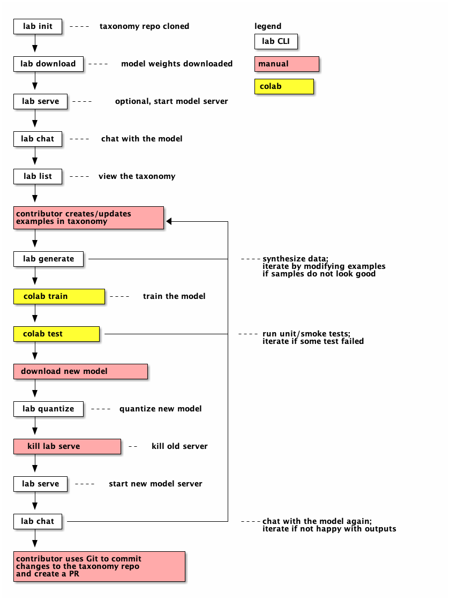

# Labrador 🐶 command-line interface `lab`

Labrador 🐶 is a novel synthetic data-based alignment tuning method for Large 
Language Models (LLMs.) The "**lab**" in **Lab**rador 🐶 stands for **L**arge-scale **A**lignment for Chat **B**ots.

This command-line interface for Labrador 🐶 (`lab`) will allow you to create models tuned 
with your data using the Labrador 🐶 method on your laptop or workstation.

*This is currently a tool that **requires an M1/M2/M3 Mac** to use; we anticipate 
future support for 🐧 Linux and other operating systems as well as for 
💻 additional hardware.*

## Contents:
* [Getting `lab`](#getting)
* [How to use `lab`](#how-to-use)
* [How to convert and quantize a model (Optional)](#model-convert-quant)

<a name="getting"></a>
# Getting `lab`

## 📋 Requirements

- 🐍 Python 3.9 or later (CLang dsitribution of Python: 15.0.0 from xcode)
- 🍎 macOS (14.x with an M1/M2/M3 Metal/GPU) 
- 📦 A quantized model in GGUF format (or read our [guide](#model-convert-quant) on to convert 
models to GGUF format and quantize them.)
- `gh` cli: Install [Github command cli](https://cli.github.com/) for downloading models from Github
  
🗒️ **Note:** The steps below use [Python venv](https://docs.python.org/3/library/venv.html) for virtual environments. If you have used [pyenv](https://github.com/pyenv/pyenv), 
[Conda Miniforge](https://github.com/conda-forge/miniforge), or another tool for Python version management on your laptop, then use the virtual environment with that tool instead. Otherwise, you may have issues with packages installed but modules 
from that package not found as they are linked to your Python version management tool and not `venv`.

## 🧰 Installation

`lab` will be available via `pip install lab-cli` in the future. At this time, 
you will need to run `lab` from source or GitHub repository URL:

### From source

```ShellSession
git clone https://github.com/open-labrador/cli.git
cd cli
python3 -m venv venv
source venv/bin/activate
pip install .
```

### From GitHub

In the following example, `<project_dir>` is any directory you create to work in.

```ShellSession
mkdir <project_dir>
cd <project_dir>
python3 -m venv venv
source venv/bin/activate
pip install git+ssh://git@github.com/open-labrador/cli.git
```

## 🚀 Running `lab`

Always be sure to activate the venv in your working shell:

```ShellSession
source venv/bin/activate
```

Then, run `lab` as follows:

```ShellSession
lab
```

### Configuration

`lab` currently requires a valid configuration file to run. By default, it
looks for a `cli/config/config.yml` file in the current directory, but you
can override that with `--config` flag like so:

```ShellSession
python -m cli --config=./config.yml generate
```
or
```ShellSession
lab --config=./config.yml generate
```
**Note:** Make sure to pass the `--config` flag after the root command name!

A sample configuration file is available in [cli/config/config.yml](cli/config/config.yml).

<a name="how-to-use"></a>
# How to use `lab`

🗒️ **Note:** The instructions below all assume that you are in the root directory of your `cli` git repository checkout or your `<project_dir>`.

Using the Labrador 🐶 method involves a number of steps, supported by various commands. You can see a flow chart showing the order of commands in a typical workflow as well as detailed command documentation below:



## 🏗️ 1. Initial setup

### Initialize environment
- Create an empty directory `project_dir` and change the current directory into `project_dir`. Initialize a local environment to use Labrador 🐶 via the **init**
command:

  ```shell
  lab init
  ```
  
  To initialize the Taxonomy from a private repository source, please use the git SSH endpoint of the private repository:
  ```shell
  lab init --repo git@github.com:open-labrador/taxonomy.git
  ```

  It will clone the `git@github.com:open-labrador/taxonomy.git` repository.

### Download model

- Download the model to train using the **download** command:

  `lab download`

  It will download all the models from the latest [release](https://github.com/open-labrador/cli/releases) into the local directory.

  Pop over to our [cli releases](https://github.com/open-labrador/cli/releases) to check out the list of available models and a set of instructions on how to do this manually;

  **Note:** Users should make sure they are either logged in to their github accounts via the `gh` CLI (which can be achieved by running `gh auth login` and following the prompts/instructions), or if using macOS, users can add their SSH keys to their apple-keychain by running:
  ```
  ssh-add --apple-use-keychain ~/.ssh/[your-private-key]
  ```

  📋 **Note:** Once you have the model chunks downloaded and reassembled according to the instructions above, please move the model to a `models/` directory in the root directory of your git checkout of this project (this assumes the model is in your `Downloads/` folder):
  ```
  mkdir models
  mv ~/Downloads/ggml-labrador13B-model-Q4_K_M.gguf models
  ```

## 🧑‍🏫 2. Model training
***
📋 **Note:** By default, the serve and generate commands assuming use of `ggml-malachite-7b-Q4_K_M.gguf` - this is a lightweight, fast model based on [Mistral](https://mistral.ai/news/announcing-mistral-7b/) that takes about ~45 min for synthetic data generation on an M1 / 16GB mac. If you have another quantized, gguf-format model you would like to use instead, there is a `--model` argument you can add to the **serve** and **generate** commands to indicate which model to use:

   - **Serve** with the `--model` argument requires indicating the directory path to the model file, e.g.:
`lab serve --model models/ggml-malachite-7b-Q4_K_M.gguf`

   - **Generate** with the `--model` argument just requires the file name of the gguf model and assumes the model is located in the `models/` subdirectory of the root `cli/` git checkout directory, e.g.:
`lab generate --model ggml-malachite-7b-Q4_K_M.gguf`
*** 

### Serve the model
- Serve the downloaded model locally via the **serve** command using the 
[llama.cpp framework](#TODO) and [llama-cpp-python](#TODO) (which provides 
Python bindings for llama.cpp):

  `lab serve`

  Once the model is being served and ready (takes less than 1 minute on an M1 mac), you'll see the following output:
  ```
  Starting server process
  After application startup complete see http://127.0.0.1:8000/docs for API.
  Press CTRL+C to shutdown server.
  INFO:     Started server process [4295]
  INFO:     Waiting for application startup.
  INFO:     Application startup complete.
  INFO:     Uvicorn running on http://127.0.0.1:8000 (Press CTRL+C to quit)
  ```

### Test the model with chat before training

- Before you start tuning your model, test its output to your prompts as a baseline so you can better understand if your training was effective later. You can do this live via a chat interface with **chat**:

  `lab chat`

  Once you are in the chat interface, you can type `/h` for help, which will list out all of the chat commands.

### Generate a dataset
- Generate a synthetic dataset to enhance your example data set using the 
**generate** command, in another venv-activated terminal with the server running:
  ```
  lab generate
  ```

  📋 **Note:** This takes about **~45 minutes** to complete on an M1 mac with 16 GB RAM. The synthetic data set will be a file starting with the name `generated` ending in a `.json` file extension in the directory of your taxonomy.  The file name includes model used and date time of generation.

  > Tip:  If you want to pickup where you left off, copy a generated JSON file into a file named `regen.json`.  `regen.json` will be picked up at the start of `lab generate` when available.


### Train the model

- Train the model on your synthetic data-enhanced dataset using **train**:

  `lab train {local path to gguf-format model} {path to root directorylocation of dataset}`

## 👩🏽‍🔬 3. Testing the fine-tuned model

### Serve the fine-tuned model
- First, stop the server you have running via `ctrl+c` in the terminal it is running in.
- Serve the fine-tuned model locally via the **serve** with the `--model` argument to specify your new model.

  `lab serve --model <New model name>`

### Try out the new model
- Try the fine-tuned model out live using a chat interface, and see if the results are better than the untrained version of the model with **chat**:

  `lab chat`

  Once you are in the chat interface, you can type `/h` for help, which will list out all of the chat commands.

### Run tests
- Run tests against the model via the **test** command:

  `lab test`

## 🎁 4. Submit your dataset!

Of course the final step is - if you've improved the model - to share your new dataset by submitting it! You'll submit it via a pull-request process, which 
is documented in the [taxonomy respository](#TODO).

<a name="model-convert-quant"></a>
# Converting a Model to GGUF and Quantizing (Optional)

The latest [llama.cpp](https://github.com/ggerganov/llama.cpp) framework 
requires the model to be converted into [GGUF](https://medium.com/@sandyeep70/ggml-to-gguf-a-leap-in-language-model-file-formats-cd5d3a6058f9) format. [GGUF](https://medium.com/@sandyeep70/ggml-to-gguf-a-leap-in-language-model-file-formats-cd5d3a6058f9) is a quantization technique. [Quantization](https://www.tensorops.ai/post/what-are-quantized-llms) is a technique used to reduce the size of large neural networks, including large language models (LLMs) by modifying the precision of their weights. If you have a model already in GGUF format, you can skip this step.

## Clone the llama.cpp repo

```shell
git clone https://github.com/ggerganov/llama.cpp.git
```

## Set up the virtual environment

```shell
cd llama.cpp
python3 -m venv venv
source venv/bin/activate
pip install -r requirements.txt
```

## Modify the conversion script

The conversion script has a bug when converting the Labrador 🐶 model.

In `convert-hf-to-gguf.py`, add the following lines (with `+`):

```diff
[...]
def write_tensors(self):
[...]
    self.gguf_writer.add_tensor(new_name, data)
 
+   if new_name == "token_embd.weight":
+       self.gguf_writer.add_tensor("output.weight", data)
+
def write(self):
    self.write_tensors()
[...]
```

## Convert a model to GGUF

The following command converts a Hugging Face model (safetensors) to [GGUF](https://github.com/ggerganov/ggml/blob/master/docs/gguf.md) format and saves it in your model directory with a `.gguf` extension.

```shell
export MODEL_DIR={model_directory}
python convert-hf-to-gguf.py $MODEL_DIR --outtype f16
```

> Note: This may take about a minute or so.

## Quantize

Optionally, for smaller/faster models with varying loss of quality use a quantized model.

#### Make the llama.cpp binaries

Build binaries like `quantize` etc. for your environment.

```shell
make
```

#### Run quantize command


```shell
./quantize {model_directory}/{f16_gguf_model} <type>
```

For example, the following command converts the f16 GGUF model to a Q4_K_M quantized model and saves it in your model directory with a `<type>.gguf` suffix (e.g. ggml-model-Q4_K_M.gguf).

```shell
./quantize $MODEL_DIR/ggml-model-f16.gguf Q4_K_M
```

> Tip: Use `./quantize help` for a list of quantization types with their relative size and output quality along with additional usage parameters.

## Contributing

Check out our [contributing](CONTRIBUTING.md) guide to learn how to contribute to the Labrador CLI.

## Other stuffs

Hosted training environment:
[This jupyter notebook hosted on Google Colab](https://colab.research.google.com/drive/1qQr7X9Js6RTuXV12mRJtDHZU-bk4WgSU?usp=sharing)

