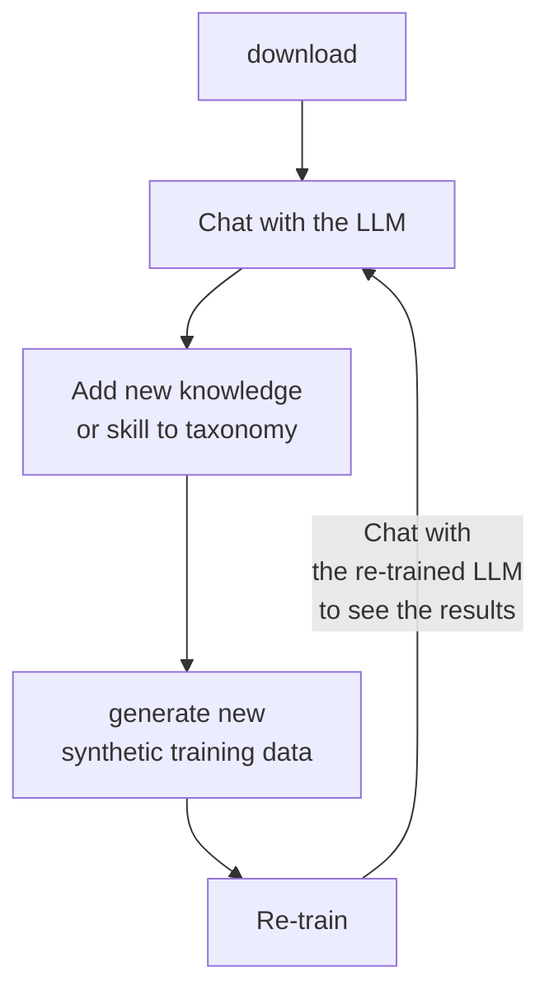

# InstructLab 🐶 (`ilab`)


## 📖 Contents

- [Welcome to the InstructLab CLI](#welcome-to-the-instructlab-cli)
- [❓ What is `ilab`](#-what-is-ilab)
- [📋 Requirements](#-requirements)
- [✅ Getting started](#-getting-started)
  - [🧰 Installing `ilab`](#-installing-ilab)
    - [Install with no GPU acceleration and PyTorch without CUDA bindings](#install-using-pytorch-without-cuda-bindings-and-no-gpu-acceleration)
    - [Install with AMD ROCm](#install-with-amd-rocm)
    - [Install with Apple Metal on M1/M2/M3 Macs](#install-with-apple-metal-on-m1m2m3-macs)
    - [Install with Nvidia CUDA](#install-with-nvidia-cuda)
  - [🏗️ Initialize `ilab`](#️-initialize-ilab)
  - [📥 Download the model](#-download-the-model)
  - [🍴 Serving the model](#-serving-the-model)
  - [📣 Chat with the model (Optional)](#-chat-with-the-model-optional)
- [💻 Creating new knowledge or skills and training the model](#-creating-new-knowledge-or-skills-and-training-the-model)
  - [🎁 Contribute knowledge or compositional skills](#-contribute-knowledge-or-compositional-skills)
  - [📜 List and validate your new data](#-list-and-validate-your-new-data)
  - [🚀 Generate a synthetic dataset](#-generate-a-synthetic-dataset)
  - [👩‍🏫 Training the model](#-training-the-model)
    - [InstructLab training pipelines](#ilab-model-training-pipelines)
    - [Train the model locally](#train-the-model-locally)
    - [Train the model locally on an M-Series Mac or on Linux using the full pipeline](#train-the-model-locally-on-an-m-series-mac-or-on-linux-using-the-full-pipeline)
    - [Train the model locally on an M-Series Mac or on Linux using the simple pipeline](#train-the-model-locally-on-an-m-series-mac-or-on-linux-using-the-simple-pipeline)
    - [Train the model locally with GPU acceleration](#train-the-model-locally-with-gpu-acceleration)
    - [Train the model in the cloud](#train-the-model-in-the-cloud)
  - [📜 Test the newly trained model](#-test-the-newly-trained-model)
  - [🧪 Evaluate the newly trained model](#-evaluate-the-newly-trained-model)
  - [🍴 Serve the newly trained model](#-serve-the-newly-trained-model)
- [📣 Chat with the new model (not optional this time)](#-chat-with-the-new-model-not-optional-this-time)
- [🚀 Upgrade InstructLab to latest version](#-upgrade-instructlab-to-latest-version)
- [🎁 Submit your new knowledge or skills](#-submit-your-new-knowledge-or-skills)
- [📬 Contributing](#-contributing)

## Welcome to the InstructLab CLI

InstructLab 🐶 uses a novel synthetic data-based alignment tuning method for
Large Language Models (LLMs.) The "**lab**" in Instruct**Lab** 🐶 stands for
[**L**arge-Scale **A**lignment for Chat**B**ots](https://arxiv.org/abs/2403.01081) [1].

[1] Shivchander Sudalairaj*, Abhishek Bhandwaldar*, Aldo Pareja*, Kai Xu, David D. Cox, Akash Srivastava*. "LAB: Large-Scale Alignment for ChatBots", arXiv preprint arXiv: 2403.01081, 2024. (* denotes equal contributions)

## ❓ What is `ilab`

`ilab` is a Command-Line Interface (CLI) tool that allows you to perform the following actions:

1. Download a pre-trained Large Language Model (LLM).
1. Chat with the LLM.

To add new knowledge and skills to the pre-trained LLM, add information to the companion [taxonomy](https://github.com/instructlab/taxonomy.git) repository.

After you have added knowledge and skills to the taxonomy, you can perform the following actions:

1. Use `ilab` to generate new synthetic training data based on the changes in your local `taxonomy` repository.
1. Re-train the LLM with the new training data.
1. Chat with the re-trained LLM to see the results.



For an overview of the full workflow, see the [workflow diagram](./docs/workflow.png).

> [!IMPORTANT]
> We have optimized InstructLab so that community members with commodity hardware can perform these steps. However, running InstructLab on a laptop will provide a low-fidelity approximation of synthetic data generation
> (using the `ilab data generate` command) and model instruction tuning (using the `ilab model train` command, which uses QLoRA). To achieve higher quality, use more sophisticated hardware and configure InstructLab to use a
> larger teacher model [such as Mixtral](https://huggingface.co/docs/transformers/model_doc/mixtral).

## 📋 Requirements

- **🍎 Apple M1/M2/M3 Mac or 🐧 Linux system** (tested on Fedora).
  We anticipate support for more operating systems in the future.
- C++ compiler
- Python 3.10 or Python 3.11
- Approximately 60GB disk space (entire process)

> **NOTE:** Python 3.12 is currently not supported, because some dependencies don't work on Python 3.12, yet.
<!-- -->
> **NOTE:** When installing the `ilab` CLI on macOS, you may have to run the `xcode-select --install` command, installing the required packages previously listed.

## ✅ Getting started

### 🧰 Installing `ilab`

1. When installing on Fedora Linux, install C++, Python 3.10 or 3.11, and other necessary tools by running the following command:

   ```shell
   sudo dnf install gcc gcc-c++ make git python3.11 python3.11-devel
   ```

   If you are running on macOS, this installation is not necessary and you can begin your process with the following step.

2. Create a new directory called `instructlab` to store the files the `ilab` CLI needs when running and `cd` into the directory by running the following command:

   ```shell
   mkdir instructlab
   cd instructlab
   ```

   > **NOTE:** The following steps in this document use [Python venv](https://docs.python.org/3/library/venv.html) for virtual environments. However, if you use another tool such as [pyenv](https://github.com/pyenv/pyenv) or [Conda Miniforge](https://github.com/conda-forge/miniforge) for managing Python environments on your machine continue to use that tool instead. Otherwise, you may have issues with packages that are installed but not found in your virtual environment.
   <!-- -->
   > **NOTE:** Some Python version management tools that build Python (instead of using a pre-built binary) may not by default build libraries implemented in C, and CPython when installing a Python version. This can therefore result in the following error when running the `ilab data generate` command: `ModuleNotFoundError: No module named '_lzma'`. This can be resolved by building CPython during the Python installation with the `--enable-framework`. For example for `pyenv` on MacOS: `PYTHON_CONFIGURE_OPTS="--enable-framework" pyenv install 3.x`. You may need to recreate you virtual environment after reinstalling Python.

3. There are a few ways you can locally install the `ilab` CLI. Select your preferred installation method from the following instructions. You can then install `ilab` and activate your `venv` environment.

   > **NOTE**: ⏳ The `python3` binary shown in the following steps is the Python version that you installed in the above step. The command can also be `python3.11` or `python3.10` instead of `python3`. You can check Python's version by `python3 -V`.
   >
   > **NOTE**: ⏳ `pip install` may take some time, depending on your internet connection. In case installation fails with error ``unsupported instruction `vpdpbusd'``, prepend `CMAKE_ARGS="-DLLAMA_NATIVE=off"` to `pip install` command.

   See [the GPU acceleration documentation](./docs/gpu-acceleration.md) for how to
   to enable hardware acceleration for interaction and training on AMD ROCm,
   Apple Metal Performance Shaders (MPS), and Nvidia CUDA.

   #### Install using PyTorch without CUDA bindings and no GPU acceleration

      ```shell
      python3 -m venv --upgrade-deps venv
      source venv/bin/activate
      pip install instructlab
      ```

      > **NOTE**: *Additional Build Argument for Intel Macs*
      >
      > If you have an Mac with an Intel CPU, you must add a prefix of
      > `CMAKE_ARGS="-DLLAMA_METAL=off"` to the `pip install` command to ensure
      > that the build is done without Apple M-series GPU support.
      >
      > `(venv) $ CMAKE_ARGS="-DLLAMA_METAL=off" pip install ...`

   #### Install with AMD ROCm

      ```shell
      python3 -m venv --upgrade-deps venv
      source venv/bin/activate
      pip cache remove llama_cpp_python
      CMAKE_ARGS="-DLLAMA_HIPBLAS=on \
         -DAMDGPU_TARGETS=all \
         -DCMAKE_C_COMPILER=/opt/rocm/llvm/bin/clang \
         -DCMAKE_CXX_COMPILER=/opt/rocm/llvm/bin/clang++ \
         -DCMAKE_PREFIX_PATH=/opt/rocm \
         -DLLAMA_NATIVE=off" \
         pip install 'instructlab[rocm]' \
         --extra-index-url https://download.pytorch.org/whl/rocm6.0
      ```

      On Fedora 40+, use `-DCMAKE_C_COMPILER=clang-17` and `-DCMAKE_CXX_COMPILER=clang++-17`.

   #### Install with Apple Metal on M1/M2/M3 Macs

      > **NOTE**: Make sure your system Python build is `Mach-O 64-bit executable arm64` by using `file -b $(command -v python)`,
      > or if your system is setup with [pyenv](https://github.com/pyenv/pyenv) by using the `file -b $(pyenv which python)` command.
      >
      > **NOTE**: Also, ensure that both `python3 -c 'import platform; print(platform.machine())'` and `arch` return `arm64`. If `arch` returns `i386` or `python3` returns `x86_64`, it means your terminal or Python is running in Intel emulation mode, which isn't optimized for Apple Silicon. This is especially important if you have synced data from an Intel-based Mac to an Apple Silicon Mac (M1/M2/M3), as you may need to review and update your environment, especially tools like `Homebrew` or `Bash` that were previously installed under Intel.

      ```shell
      python3 -m venv --upgrade-deps venv
      source venv/bin/activate
      pip cache remove llama_cpp_python
      pip install 'instructlab[mps]'
      ```

   #### Install with Nvidia CUDA

     For the best CUDA experience, installing vLLM is necessary to serve Safetensors format models.

      ```shell
      python3 -m venv --upgrade-deps venv
      source venv/bin/activate
      pip cache remove llama_cpp_python
      CMAKE_ARGS="-DLLAMA_CUDA=on -DLLAMA_NATIVE=off" pip install 'instructlab[cuda]'
      pip install vllm@git+https://github.com/opendatahub-io/vllm@2024.08.01
   ```

4. From your `venv` environment, verify `ilab` is installed correctly, by running the `ilab` command.

   ```shell
   ilab
   ```

   *Example output of the `ilab` command*

   ```shell
   (venv) $ ilab
   Usage: ilab [OPTIONS] COMMAND [ARGS]...

     CLI for interacting with InstructLab.

     If this is your first time running InstructLab, it's best to start with `ilab config init` to create the environment.

   Options:
     --config PATH  Path to a configuration file.  [default:
                    /home/user/.config/instructlab/config.yaml]
     -v, --verbose  Enable debug logging (repeat for even more verbosity)
     --version      Show the version and exit.
     --help         Show this message and exit.

   Commands:
     config    Command Group for Interacting with the Config of InstructLab.
     data      Command Group for Interacting with the Data generated by...
     model     Command Group for Interacting with the Models in InstructLab.
     system    Command group for all system-related command calls
     taxonomy  Command Group for Interacting with the Taxonomy of InstructLab.

   Aliases:
     chat      model chat
     generate  data generate
     serve     model serve
     train     model train
   ```

   > **IMPORTANT** Every `ilab` command needs to be run from within your Python virtual environment. You can enter the Python environment by running the `source venv/bin/activate` command.

5. Optional: You can enable tab completion for the `ilab` command.

   #### Bash (version 4.4 or newer)

   > **NOTE**: To use Bash version 4.4 or higher on macOS (default is 3.2.57), ensure your login shell is set to the updated version. You can verify this with `echo $SHELL`. If you encounter the error `bash: complete: nosort: invalid option name`, check your terminal or configuration files (e.g., ~/.bash_profile, ~/.bashrc, ~/.profile) to see whether they are referencing the old version for login.

   Enable tab completion in `bash` with the following command:

   ```sh
   eval "$(_ILAB_COMPLETE=bash_source ilab)"
   ```

   To have this enabled automatically every time you open a new shell,
   you can save the completion script and source it from `~/.bashrc`:

   ```sh
   _ILAB_COMPLETE=bash_source ilab > ~/.ilab-complete.bash
   echo ". ~/.ilab-complete.bash" >> ~/.bashrc
   ```

   #### Zsh

   Enable tab completion in `zsh` with the following command:

   ```sh
   eval "$(_ILAB_COMPLETE=zsh_source ilab)"
   ```

   To have this enabled automatically every time you open a new shell,
   you can save the completion script and source it from `~/.zshrc`:

   ```sh
   _ILAB_COMPLETE=zsh_source ilab > ~/.ilab-complete.zsh
   echo ". ~/.ilab-complete.zsh" >> ~/.zshrc
   ```

   #### Fish

   Enable tab completion in `fish` with the following command:

   ```sh
   _ILAB_COMPLETE=fish_source ilab | source
   ```

   To have this enabled automatically every time you open a new shell,
   you can save the completion script and source it from `~/.bashrc`:

   ```sh
   _ILAB_COMPLETE=fish_source ilab > ~/.config/fish/completions/ilab.fish
   ```

### 🏗️ Initialize `ilab`

1. Initialize `ilab` by running the following command:

   ```shell
   ilab config init
   ```

   *Example output*

   ```shell
   Welcome to InstructLab CLI. This guide will help you set up your environment.
   Please provide the following values to initiate the environment [press Enter for defaults]:
   Path to taxonomy repo [taxonomy]: <ENTER>
   ```

2. When prompted by the interface, press **Enter** to add a new default `config.yaml` file.

3. When prompted, clone the `https://github.com/instructlab/taxonomy.git` repository into the current directory by typing **y**.

   **Optional**: If you want to point to an existing local clone of the `taxonomy` repository, you can pass the path interactively or alternatively with the `--taxonomy-path` flag.

   *Example output after initializing `ilab`*

   ```shell
   (venv) $ ilab config init
   Welcome to InstructLab CLI. This guide will help you set up your environment.
   Please provide the following values to initiate the environment [press Enter for defaults]:
   Path to taxonomy repo [taxonomy]: <ENTER>
   `taxonomy` seems to not exists or is empty. Should I clone https://github.com/instructlab/taxonomy.git for you? [y/N]: y
   Cloning https://github.com/instructlab/taxonomy.git...
   ```

   `ilab` will use the default configuration file unless otherwise specified. You can override this behavior with the `--config` parameter for any `ilab` command.

4. When prompted, provide the path to your default model. Otherwise, the default of a quantized [Merlinite](https://huggingface.co/instructlab/merlinite-7b-lab-GGUF) model will be used - you can download this model with `ilab model download` (see below).

   ```shell
   (venv) $ ilab config init
   Welcome to InstructLab CLI. This guide will help you set up your environment.
   Please provide the following values to initiate the environment [press Enter for defaults]:
   Path to taxonomy repo [taxonomy]: <ENTER>
   `taxonomy` seems to not exists or is empty. Should I clone https://github.com/instructlab/taxonomy.git for you? [y/N]: y
   Cloning https://github.com/instructlab/taxonomy.git...
   Path to your model [/home/user/.cache/instructlab/models/merlinite-7b-lab-Q4_K_M.gguf]: <ENTER>
   ```

5. When prompted, please choose a train profile. Train profiles are GPU specific profiles that enable accelerated training behavior. If you are on MacOS or a Linux machine without a dedicated GPU, please choose `No Profile (CPU, Apple Metal, AMD ROCm)` by hitting Enter. There are various flags you can utilize with individual `ilab` commands that allow you to utilize your GPU if applicable.

   ```shell
   Welcome to InstructLab CLI. This guide will help you to setup your environment.
   Please provide the following values to initiate the environment [press Enter for defaults]:
   Path to taxonomy repo [/home/user/.local/share/instructlab/taxonomy]:
   Path to your model [/home/user/.cache/instructlab/models/merlinite-7b-lab-Q4_K_M.gguf]:
   Generating `/home/user/.config/instructlab/config.yaml` and `/home/user/.local/share/instructlab/internal/train_configuration/profiles`...
   Please choose a train profile to use.
   Train profiles assist with the complexity of configuring specific GPU hardware with the InstructLab Training library.
   You can still take advantage of hardware acceleration for training even if your hardware is not listed.
   [0] No profile (CPU, Apple Metal, AMD ROCm)
   [1] Nvidia A100/H100 x2 (A100_H100_x2.yaml)
   [2] Nvidia A100/H100 x4 (A100_H100_x4.yaml)
   [3] Nvidia A100/H100 x8 (A100_H100_x8.yaml)
   [4] Nvidia L40 x4 (L40_x4.yaml)
   [5] Nvidia L40 x8 (L40_x8.yaml)
   [6] Nvidia L4 x8 (L4_x8.yaml)
   Enter the number of your choice [hit enter for no profile] [0]:
   No profile selected - any hardware acceleration for training must be configured manually.
   Initialization completed successfully, you're ready to start using `ilab`. Enjoy!
   ```

   The GPU profiles are listed by GPU type and number of GPUs present. If you happen to have a GPU configuration with a similar amount of vRAM as any of the above profiles, feel free to try them out!

### `ilab` directory layout after initializing your system

After running `ilab config init` your directories will look like the following on a Linux system:

| **Directory**                              | **Description**                                                                 |
|--------------------------------------------|---------------------------------------------------------------------------------|
| `~/.cache/instructlab/models/`             | Contains all downloaded large language models, including the saved output of ones you generate with ilab.|
| `~/.local/share/instructlab/datasets/`     | Contains data output from the SDG phase, built on modifications to the taxonomy repository.   |
| `~/.local/share/instructlab/taxonomy/`     | Contains the skill and knowledge data.                                              |
| `~/.local/share/instructlab/checkpoints/`  | Contains the output of the training process.                                |

### 📥 Download the model

- Run the `ilab model download` command.

  ```shell
  ilab model download
  ```

  `ilab model download` downloads a compact pre-trained version of the [model](https://huggingface.co/instructlab/) (~4.4G) from HuggingFace:

  ```shell
  (venv) $ ilab model download
  Downloading model from Hugging Face: instructlab/merlinite-7b-lab-GGUF@main to /home/user/.cache/instructlab/models...
  ...
  INFO 2024-08-01 15:05:48,464 huggingface_hub.file_download:1893: Download complete. Moving file to /home/user/.cache/instructlab/models/merlinite-7b-lab-Q4_K_M.gguf
  ```

  > **NOTE** ⏳ This command can take few minutes or immediately depending on your internet connection or model is cached. If you have issues connecting to Hugging Face, refer to the [Hugging Face discussion forum](https://discuss.huggingface.co/) for more details.

  #### Downloading a specific model from a Hugging Face repository

- Specify repository, model, and a Hugging Face token if necessary. More information about Hugging Face tokens can be found [here](https://huggingface.co/docs/hub/en/security-tokens)

  ```shell
  HF_TOKEN=<YOUR HUGGINGFACE TOKEN GOES HERE> ilab model download --repository=TheBloke/Mixtral-8x7B-Instruct-v0.1-GGUF --filename=mixtral-8x7b-instruct-v0.1.Q4_K_M.gguf
  ```

  #### Downloading an entire Hugging Face repository (Safetensors Model)

- Specify repository, and a Hugging Face token if necessary. For example:

  ```shell
  HF_TOKEN=<YOUR HUGGINGFACE TOKEN GOES HERE> ilab model download --repository=instructlab/granite-7b-lab
  ```

  These types of models are useful for GPU-enabled systems or anyone looking to serve a model using vLLM. InstructLab provides Safetensor versions of our Granite models on HuggingFace.

  #### Listing downloaded models

- All downloaded models can be seen with `ilab model list`.

  ```shell
  ilab model list
  ```

  *Example output of `ilab model list` after `ilab model download`*

  ```shell
  (venv) $ ilab model list
  +------------------------------+---------------------+--------+
  | Model Name                   | Last Modified       | Size   |
  +------------------------------+---------------------+--------+
  | merlinite-7b-lab-Q4_K_M.gguf | 2024-08-01 15:05:48 | 4.1 GB |
  +------------------------------+---------------------+--------+
  ```

### 🍴 Serving the model

- Serve the model by running the following command:

   ```shell
   ilab model serve
   ```

- Serve a non-default model (e.g. Mixtral-8x7B-Instruct-v0.1):

   ```shell
   ilab model serve --model-path models/mixtral-8x7b-instruct-v0.1.Q4_K_M.gguf
   ```

- Once the model is served and ready, you'll see the following output:

   ```shell
   (venv) $ ilab model serve
   INFO 2024-03-02 02:21:11,352 lab.py:201 Using model 'models/ggml-merlinite-7b-lab-Q4_K_M.gguf' with -1 gpu-layers and 4096 max context size.
   Starting server process
   After application startup complete see http://127.0.0.1:8000/docs for API.
   Press CTRL+C to shut down the server.
   ```

   > **NOTE:** If multiple `ilab` clients try to connect to the same InstructLab server at the same time, the 1st will connect to the server while the others will start their own temporary server. This will require additional resources on the host machine.

- Serve a non-default Safetensors model (e.g. granite-7b-lab). NOTE: this requires a GPU.

   Ensure vllm is installed:

   ```shell
   pip show vllm
   ```

   If it is not, please run:

   ```shell
   pip install vllm@git+https://github.com/opendatahub-io/vllm@2024.08.01
   ```

   ```shell
   ilab model serve --model-path ~/.cache/instructlab/models/instructlab/granite-7b-lab
   ```

### 📣 Chat with the model (Optional)

Because you're serving the model in one terminal window, you will have to create a new window and re-activate your Python virtual environment to run `ilab model chat` command:

```shell
source venv/bin/activate
ilab model chat
```

Chat with a non-default model (e.g. Mixtral-8x7B-Instruct-v0.1):

```shell
source venv/bin/activate
ilab model chat --model models/mixtral-8x7b-instruct-v0.1.Q4_K_M.gguf
```

Please note that usage of `--model` necessitates that the existing server has that model. If not, you must exit the server. `--model` in `ilab model chat` has the ability to start a server on your behalf with the specified model if one is not already running on the port.

Before you start adding new skills and knowledge to your model, you can check its baseline performance by asking it a question such as `what is the capital of Canada?`.

> **NOTE:** the model needs to be trained with the generated synthetic data to use the new skills or knowledge

```shell
(venv) $ ilab model chat
╭────────────────────────────────────────────────────────────────────────────────────────────────────────────────── system ──────────────────────────────────────────────────────────────────────────────────────────────────────────────────╮
│ Welcome to InstructLab Chat w/ GGML-MERLINITE-7B-lab-Q4_K_M (type /h for help)                                                                                                                                                             │
╰────────────────────────────────────────────────────────────────────────────────────────────────────────────────────────────────────────────────────────────────────────────────────────────────────────────────────────────────────────────╯
>>> what is the capital of Canada?                                                                                                                                                                                                [S][default]
╭────────────────────────────────────────────────────────────────────────────────────────────────────── ggml-merlinite-7b-lab-Q4_K_M ───────────────────────────────────────────────────────────────────────────────────────────────────────╮
│ The capital city of Canada is Ottawa. It is located in the province of Ontario, on the southern banks of the Ottawa River in the eastern portion of southern Ontario. The city serves as the political center for Canada, as it is home to │
│ Parliament Hill, which houses the House of Commons, Senate, Supreme Court, and Cabinet of Canada. Ottawa has a rich history and cultural significance, making it an essential part of Canada's identity.                                   │
╰─────────────────────────────────────────────────────────────────────────────────────────────────────────────────────────────────────────────────────────────────────────────────────────────────────────────────── elapsed 12.008 seconds ─╯
>>>                                                                                                                                                                                                                               [S][default]
```

## 💻 Creating new knowledge or skills and training the model

### 🎁 Contribute knowledge or compositional skills

1. Contribute new knowledge or compositional skills to your local [taxonomy](https://github.com/instructlab/taxonomy.git) repository.

Detailed contribution instructions can be found in the [taxonomy repository](https://github.com/instructlab/taxonomy/blob/main/README.md).

> [!IMPORTANT]
> There is a limit to how much content can exist in the question/answer pairs for the model to process. Due to this, only add a maximum of around 2300 words to your question and answer seed example pairs in the `qna.yaml` file.

### 📜 List and validate your new data

You can use the `ilab taxonomy diff` command to ensure `ilab` is registering your new knowledge or skills and your contributions are properly formatted. This command displays any new or modified YAML files within your taxonomy tree. For example, the following is the expected result of a valid compositional skill contribution after adding a new skill called `foo-lang` to the freeform writing subdirectory:

```shell
(venv) $ ilab taxonomy diff
compositional_skills/writing/freeform/foo-lang/qna.yaml
Taxonomy in $HOME/.local/share/instructlab/taxonomy is valid :)
```

You can also validate your entire taxonomy by performing a diff against an empty base by using the `--taxonomy-base=empty` argument:

```shell
(venv) $ ilab taxonomy diff --taxonomy-base=empty
compositional_skills/general/tables/empty/qna.yaml
compositional_skills/general/tables/editing/add_remove/qna.yaml
...
Taxonomy in $HOME/.local/share/instructlab/taxonomy is valid :)
```

### 🚀 Generate a synthetic dataset

Before following these instructions, ensure the existing model you are adding skills or knowledge to is still running. Alternatively, `ilab data generate` can start a server for you if you provide a fully qualified model path via `--model`.

1. To generate a synthetic dataset based on your newly added knowledge or skill set in [taxonomy](https://github.com/instructlab/taxonomy.git) repository, run the following command:

   With GPU acceleration:

   ```shell
   ilab data generate --pipeline full --gpus <NUM_OF_GPUS>
   ```

   Without GPU acceleration:

   ```shell
   ilab data generate --pipeline simple
   ```

   Use a non-default model (e.g. Mixtral-8x7B-Instruct-v0.1) to generate data, run the following command:

   ```shell
   ilab data generate --model ~/.cache/instructlab/models/mistralai/mixtral-8x7b-instruct-v0.1 --pipeline full --gpus 4
   ```

   > **NOTE:** ⏳ This can take from 15 minutes to 1+ hours to complete, depending on your computing resources.

   *Example output of `ilab data generate`*

   ```shell
   (venv) $ ilab data generate
   INFO 2024-07-30 19:57:44,093 numexpr.utils:161: NumExpr defaulting to 8 threads.
   INFO 2024-07-30 19:57:44,452 datasets:58: PyTorch version 2.3.1 available.
   Generating synthetic data using 'simple' pipeline, '$HOME/.cache/instructlab/models/mixtral-8x7b-instruct-v0.1.Q4_K_M.gguf' model, './taxonomy' taxonomy, against http://localhost:8000/v1 server
   INFO 2024-07-30 19:57:45,084 instructlab.sdg:375: Synthesizing new instructions. If you aren't satisfied with the generated instructions, interrupt training (Ctrl-C) and try adjusting your YAML files. Adding more examples may help.
   INFO 2024-07-30 19:57:45,090 instructlab.sdg.pipeline:153: Running pipeline single-threaded
   INFO 2024-07-30 19:57:47,820 instructlab.sdg.llmblock:51: LLM server supports batched inputs: False
   INFO 2024-07-30 19:57:47,820 instructlab.sdg.pipeline:197: Running block: gen_skill_freeform
   INFO 2024-07-30 19:57:47,820 instructlab.sdg.pipeline:198: Dataset({
      features: ['task_description', 'seed_question', 'seed_response'],
      num_rows: 5
   })
   INFO 2024-07-30 20:02:16,455 instructlab.sdg:411: Generated 1 samples
   ...
   ```

   The synthetic data set will be two files in the newly created in the datasets directory: `~/.local/share/instructlab/datasets`. These files will be named `skills_train_msgs_*.jsonl` and `knowledge_train_msgs_*.jsonl`.

2. Verify the files have been created by running the `ls datasets` command. Note: you must be in your `XDG_DATA_HOME/instructlab` directory.

   ```shell
   (venv) $ ls datasets/
   ├── node_datasets_2024-08-12T20_31_15
   ├── node_datasets_2024-08-13T19_51_48
   ├── knowledge_recipe_2024-08-12T20_31_15.yaml
   ├── knowledge_recipe_2024-08-13T19_51_48.yaml
   ├── knowledge_train_msgs_2024-08-12T20_31_15.jsonl
   ├── knowledge_train_msgs_2024-08-13T19_51_48.jsonl
   ├── skills_recipe_2024-08-12T20_31_15.yaml
   ├── skills_recipe_2024-08-13T19_51_48.yaml
   ├── skills_train_msgs_2024-08-12T20_31_15.jsonl
   ├── skills_train_msgs_2024-08-13T19_51_48.jsonl
   ├── messages_mixtral-8x7b-instruct-v0-1_2024-08-12T20_31_15.jsonl
   ├── messages_mixtral-8x7b-instruct-v0-1_2024-08-13T19_51_48.jsonl
   ├── test_mixtral-8x7b-instruct-v0-1_2024-08-12T20_13_21.jsonl
   ├── test_mixtral-8x7b-instruct-v0-1_2024-08-12T20_23_06.jsonl
   ├── test_mixtral-8x7b-instruct-v0-1_2024-08-12T20_31_15.jsonl
   ├── test_mixtral-8x7b-instruct-v0-1_2024-08-13T19_47_59.jsonl
   ├── test_mixtral-8x7b-instruct-v0-1_2024-08-13T19_51_48.jsonl
   ├── train_mixtral-8x7b-instruct-v0-1_2024-08-12T20_31_15.jsonl
   └── train_mixtral-8x7b-instruct-v0-1_2024-08-13T19_51_48.jsonl
   ```

   **Optional**: It is also possible to run the generate step against a different model via an
   OpenAI-compatible API. For example, the one spawned by `ilab model serve` or any remote or locally hosted LLM (e.g. via [`ollama`](https://ollama.com/), [`LM Studio`](https://lmstudio.ai), etc.). Run the following command:

   ```shell
   ilab data generate --endpoint-url http://localhost:8000/v1
   ```

Note that it is also possible to generate a synthetic dataset based on the entire contents of the taxonomy repo using the `--taxonomy-base=empty` option:

   ```shell
   ilab data generate --taxonomy-base=empty
   ```

### 👩‍🏫 Training the model

There are many options for training the model with your synthetic data-enhanced dataset.

> **Note:** **Every** `ilab` command needs to run from within your Python virtual environment.

#### ilab model training pipelines

`ilab model train` has three pipelines: `simple`, `full`, and `accelerated`. The default is `accelerated`.

1. `simple` uses an SFT Trainer on Linux and MLX on MacOS. This type of training takes roughly an hour and produces the lowest fidelity model but should indicate if your data is being picked up by the training process.
2. `full` uses a custom training loop and data processing funcions for the granite family of models. This loop is optimizied for CPU and MPS functionality. Please use `--pipeline=full` in combination with `--device=cpu` (Linux) or `--device=mps` (MacOS). You can also use `--device=cpu` on a MacOS machine. However, MPS is optimized for better performance on these systems.
3. `accelerated` uses the instructlab-training library which supports GPU accelerated and distributed training. The `full` loop and data processing functions are either pulled directly from or based off of the work in this library.

#### Train the model locally

```shell
ilab model train
```

> **NOTE:** ⏳ This step can potentially take **several hours** to complete depending on your computing resources. Please stop `ilab model chat` and `ilab model serve` first to free resources.

After running `ilab model train`, the output locations depend on the chosen pipeline or strategy:

| **Pipeline/Strategy**              | **Operating System** | **Output Location/Details**                                                                                             |
|------------------------------------|----------------------|--------------------------------------------------------------------------------------------------------------------------|
| `simple`                           | Linux                | Model saved in `models` directory as `ggml-model-f16.gguf`.                                                              |
|                                    | MacOS                | Model saved in `<model_name>-mlx-q` directory.                                                                           |
| `full`                             | Linux & MacOS        | `.bin` and `.gguf` models saved in `~/.local/share/instructlab/checkpoints/hf_format` directory. Two models in each `sample_*` directory: one quantized (`Q4-M-K` suffix) and one full precision. |
| `accelerated`                      | Linux                | Models saved in `~/.local/share/instructlab/checkpoints`. Can be evaluated with `ilab model evaluate` to choose the best one. |
| `lab-multiphase`                   | Linux                | Phase 1 models saved in `~/.local/share/instructlab/phased/phase1/checkpoints` (Knowledge training). Phase 2 models saved in `~/.local/share/instructlab/phased/phase2/checkpoints` (Skills training). Evaluation is run for both phases to identify the best checkpoint. |

When running multi phase training evaluation is run on each phase, we will tell you which checkpoint in this folder performs the best.

#### Train the model locally on an M-series Mac or on Linux using the full pipeline

To train the model locally on your M-Series Mac using our full pipeline and MPS or on your Linux laptop/deskop using CPU:

```shell
ilab model train --pipeline full --device mps
```

```shell
ilab model train --pipeline full --device cpu
```

> **Note:** ⏳ This process will take a while to complete. If you run for ~8 epochs it will take several hours.

`ilab model train` outputs a directory for each epoch that resembles the following structure:

```shell
$ ls ~/.local/share/instructlab/checkpoints/hf_format/samples_0/
├── added_tokens.json
├── config.json
├── pytorch_model.bin
├── pytorch_model.gguf
├── pytorch_model-Q4_K_M.gguf
├── special_tokens_map.json
├── tokenizer.json
├── tokenizer_config.json
└── tokenizer.model
```

this entire folder can be served on a system that supports vLLM using the .bin model. However, on most laptops you can serve either the full precision gguf: `pytorch_model.gguf` or the 4-bit-quantized one: `pytorch_model-Q4_K_M.gguf`.

#### Train the model locally on an M-series Mac or on Linux using the simple pipeline

To train the model locally on your M-Series Mac using our simple pipeline and MLX or on your Linux laptop/deskop using an SFT Trainer:

```shell
ilab model train --pipeline simple
```

> **Note:** ⏳ This process will take a little while to complete (time can vary based on hardware
and output of `ilab data generate` but on the order of 5 to 15 minutes)

on a Mac `ilab model train` outputs a brand-new model that is saved in the `<model_name>-mlx-q` directory called `adapters.npz` (in `Numpy` compressed array format). For example:

```shell
(venv) $ ls instructlab-merlinite-7b-lab-mlx-q/
├── adapters-010.npz
├── adapters-020.npz
├── adapters-030.npz
├── adapters-040.npz
├── adapters-050.npz
├── adapters-060.npz
├── adapters-070.npz
├── adapters-080.npz
├── adapters-090.npz
├── adapters-100.npz
├── adapters.npz
├── added_tokens.json
├── config.json
├── model.safetensors
├── special_tokens_map.json
├── tokenizer.json
├── tokenizer.model
└── tokenizer_config.json
```

on Linux `ilab model train` outputs a brand-new model that can be served in the `models` directory called `ggml-model-f16.gguf`.

#### Train the model locally with GPU acceleration

Training has experimental support for GPU acceleration with Nvidia CUDA or AMD ROCm. Please see [the GPU acceleration documentation](./docs/gpu-acceleration.md) for more details. At present, hardware acceleration requires a data center GPU or high-end consumer GPU with at least 18 GB free memory.

```shell
ilab model train --pipeline accelerated --device cuda
```

This version of `ilab model train` outputs brand-new models that can be served in the `~/.local/share/instructlab/checkpoints` directory.  These models can be run through `ilab model evaluate` to choose the best one.

#### Train the model locally with multi-phase training and GPU acceleration

`ilab model train` supports multi-phase training. This results in the following workflow:

1. We train the model on knowledge
2. Evaluate the trained model to find the best checkpoint
3. We train the model on skills
4. We evaluate the model to find the best overall checkpoint

```shell
ilab model train --strategy lab-multiphase --phased-phase1-data <knowledge train messages jsonl> --phased-phase2-data <skills train messages jsonl> -y
```

This command takes in two `.jsonl` files from your `datasets` directory, one is the knowledge jsonl and the other is a skills jsonl. The `-y` flag skips an interactive prompt asking the user if they are sure they want to run multi-phase training.

Note: this command may take 3 or more hours depending on the size of the data and number of training epochs you run.

#### Train the model in the cloud

Follow the instructions in [Training](./notebooks/README.md).

⏳ Approximate amount of time taken on each platform:

- *Google Colab*: **5-10 minutes** with a T4 GPU
- *Kaggle*: **~30 minutes** with a P100 GPU.

After that's done, you can play with your model directly in the Google Colab or Kaggle notebook. Model trained on the cloud will be saved on the cloud.
The model can also be downloaded and served locally.

### 📜 Test the newly trained model

- Run the following command to test the model:

   ```shell
   ilab model test
   ```

   The output from the command will consist of a series of outputs from the model before and after training.

### 🧪 Evaluate the newly trained model

You can use the `ilab model evaluate` command to evaluate the models you are training with several benchmarks. Currently, four benchmarks are supported.

| Benchmark | Measures | Full Name | Description | Reference |
| --- | --- | --- | --- | --- |
| MMLU | Knowledge | Massive Multitask Language Understanding | Tests a model against a standardized set of knowledge data and produces a score based on the model's performance | [Measuring Massive Multitask Language Understanding](https://arxiv.org/abs/2009.03300) |
| MMLUBranch | Knowledge | N/A | Tests your knowledge contributions against a base model and produces a score based on the difference in performance | N/A |
| MTBench | Skills | Multi-turn Benchmark | Tests a model's skill at applying its knowledge against a judge model and produces a score based on the model's performance | [MT-Bench (Multi-turn Benchmark)](https://klu.ai/glossary/mt-bench-eval) |
| MTBenchBranch | Skills | N/A | Tests your skill contributions against a judge model and produces a score based on the difference in performance | N/A |

> [!NOTE]
> Evaluation must be used with local models (safetensors or GGUF format). Using models directly from Hugging Face without downloading them is unsupported.
> GGUF models are not yet supported for mmlu and mmlu_branch evaluations
> MTBench and MTBenchBranch use [prometheus-8x7b-v2.0](https://huggingface.co/prometheus-eval/prometheus-8x7b-v2.0) as the judge model by
default. While you do not need to use this model as your judge, it is strongly recommended to do so if you have the necessary hardware
resources. You can download it via `ilab model download`.

#### Running MMLU

Below is an example of running MMLU with a local safetensors model directory:

```bash
$ export ILAB_MODELS_DIR=$HOME/.local/share/instructlab/models
$ ilab model evaluate --benchmark mmlu --model $ILAB_MODELS_DIR/instructlab/granite-7b-test
...
# KNOWLEDGE EVALUATION REPORT

## MODEL (SCORE)
/home/user/.cache/instructlab/models/instructlab/granite-7b-test (0.52/1.0)

### SCORES (0.0 to 1.0):
mmlu_abstract_algebra - 0.31
mmlu_anatomy - 0.46
mmlu_astronomy - 0.52
mmlu_business_ethics - 0.55
mmlu_clinical_knowledge - 0.57
mmlu_college_biology - 0.56
mmlu_college_chemistry - 0.38
mmlu_college_computer_science - 0.46
mmlu_college_mathematics - 0.34
mmlu_college_medicine - 0.49
mmlu_college_physics - 0.27
mmlu_computer_security - 0.66
mmlu_conceptual_physics - 0.38
mmlu_econometrics - 0.39
mmlu_electrical_engineering - 0.48
mmlu_elementary_mathematics - 0.3
mmlu_formal_logic - 0.38
mmlu_global_facts - 0.34
mmlu_high_school_biology - 0.56
mmlu_high_school_chemistry - 0.43
mmlu_high_school_computer_science - 0.53
mmlu_high_school_european_history - 0.63
mmlu_high_school_geography - 0.62
mmlu_high_school_government_and_politics - 0.74
mmlu_high_school_macroeconomics - 0.52
mmlu_high_school_mathematics - 0.24
mmlu_high_school_microeconomics - 0.51
mmlu_high_school_physics - 0.34
mmlu_high_school_psychology - 0.72
mmlu_high_school_statistics - 0.36
mmlu_high_school_us_history - 0.68
mmlu_high_school_world_history - 0.73
mmlu_human_aging - 0.59
mmlu_human_sexuality - 0.6
mmlu_international_law - 0.67
mmlu_jurisprudence - 0.56
mmlu_logical_fallacies - 0.67
mmlu_machine_learning - 0.3
mmlu_management - 0.7
mmlu_marketing - 0.79
mmlu_medical_genetics - 0.51
mmlu_miscellaneous - 0.7
mmlu_moral_disputes - 0.57
mmlu_moral_scenarios - 0.3
mmlu_nutrition - 0.55
mmlu_philosophy - 0.55
mmlu_prehistory - 0.59
mmlu_professional_accounting - 0.39
mmlu_professional_law - 0.4
mmlu_professional_medicine - 0.44
mmlu_professional_psychology - 0.53
mmlu_public_relations - 0.6
mmlu_security_studies - 0.62
mmlu_sociology - 0.67
mmlu_us_foreign_policy - 0.79
mmlu_virology - 0.42
mmlu_world_religions - 0.68
```

#### Running MMLUBranch

Below is an example of running MMLUBranch with a local safetensors model directory:

```bash
$ export ILAB_MODELS_DIR=$HOME/.local/share/instructlab/models
$ ilab model evaluate --benchmark mmlu_branch --model $ILAB_MODELS_DIR/instructlab/granite-7b-test --base-model $ILAB_MODELS_DIR/instructlab/granite-7b-lab
...
# KNOWLEDGE EVALUATION REPORT

## BASE MODEL (SCORE)
/home/user/.cache/instructlab/models/instructlab/granite-7b-lab (0.74/1.0)

## MODEL (SCORE)
/home/user/.cache/instructlab/models/instructlab/granite-7b-test (0.78/1.0)

### IMPROVEMENTS (0.0 to 1.0):
1. tonsils: 0.74 -> 0.78 (+0.04)
```

#### Running MTBench

Below is an example of running MTBench with a local safetensors model directory:

```bash
$ export ILAB_MODELS_DIR=$HOME/.local/share/instructlab/models
$ ilab model evaluate --benchmark mt_bench --model $ILAB_MODELS_DIR/instructlab/granite-7b-test
...
# SKILL EVALUATION REPORT

## MODEL (SCORE)
/home/user/.cache/instructlab/models/instructlab/granite-7b-test (7.27/10.0)

### TURN ONE (0.0 to 10.0):
7.48

### TURN TWO (0.0 to 10.0):
7.05
```

#### Running MTBenchBranch

Below is an example of running MTBenchBranch with a local safetensors model directory:

```bash
$ export ILAB_MODELS_DIR=$HOME/.local/share/instructlab/models
$ export ILAB_TAXONOMY_DIR=$HOME/.local/share/instructlab/taxonomy
$ ilab model evaluate --benchmark mt_bench_branch \
   --model $ILAB_MODELS_DIR/instructlab/granite-7b-test \
   --base-model $ILAB_MODELS_DIR/instructlab/granite-7b-lab \
   --taxonomy-path $ILAB_TAXONOMY_DIR \
   --branch rc \
   --base-branch main
...
# SKILL EVALUATION REPORT

## BASE MODEL (SCORE)
/home/user/.cache/instructlab/models/instructlab/granite-7b-lab (5.78/10.0)

## MODEL (SCORE)
/home/user/.cache/instructlab/models/instructlab/granite-7b-test (6.00/10.0)

### IMPROVEMENTS (0.0 to 10.0):
1. foundational_skills/reasoning/linguistics_reasoning/object_identification/qna.yaml: 4.0 -> 6.67 (+2.67)
2. foundational_skills/reasoning/theory_of_mind/qna.yaml: 3.12 -> 4.0 (+0.88)
3. foundational_skills/reasoning/linguistics_reasoning/logical_sequence_of_words/qna.yaml: 9.33 -> 10.0 (+0.67)
4. foundational_skills/reasoning/logical_reasoning/tabular/qna.yaml: 5.67 -> 6.33 (+0.67)
5. foundational_skills/reasoning/common_sense_reasoning/qna.yaml: 1.67 -> 2.33 (+0.67)
6. foundational_skills/reasoning/logical_reasoning/causal/qna.yaml: 5.67 -> 6.0 (+0.33)
7. foundational_skills/reasoning/logical_reasoning/general/qna.yaml: 6.6 -> 6.8 (+0.2)
8. compositional_skills/writing/grounded/editing/content/qna.yaml: 6.8 -> 7.0 (+0.2)
9. compositional_skills/general/synonyms/qna.yaml: 4.5 -> 4.67 (+0.17)

### REGRESSIONS (0.0 to 10.0):
1. foundational_skills/reasoning/unconventional_reasoning/lower_score_wins/qna.yaml: 5.67 -> 4.0 (-1.67)
2. foundational_skills/reasoning/mathematical_reasoning/qna.yaml: 7.33 -> 6.0 (-1.33)
3. foundational_skills/reasoning/temporal_reasoning/qna.yaml: 5.67 -> 4.67 (-1.0)

### NO CHANGE (0.0 to 10.0):
1. foundational_skills/reasoning/linguistics_reasoning/odd_one_out/qna.yaml (9.33)
2. compositional_skills/grounded/linguistics/inclusion/qna.yaml (6.5)
```

### 🍴 Serve the newly trained model

1. Stop the server you have running by entering `ctrl+c` keys in the terminal running the server.

   > **IMPORTANT**:
   - 🍎 This step is only implemented for macOS with M-series chips (for now).

   - Before serving the newly trained model you must convert it to work with
   the `ilab` cli. The `ilab model convert` command converts the new model into quantized [GGUF](https://medium.com/@sandyeep70/ggml-to-gguf-a-leap-in-language-model-file-formats-cd5d3a6058f9) format which is required by the server to host the model in the `ilab model serve` command.

2. Convert the newly trained model by running the following command:

   ```shell
   ilab model convert
   ```

3. Serve the newly trained model locally via `ilab model serve` command with the `--model-path`
argument to specify your new model:

   ```shell
   ilab model serve --model-path <new model path>
   ```

   Which model should you select to serve? After running the `ilab model convert` command, some files and a directory are generated. The model you will want to serve ends with an extension of `.gguf`
   and exists in a directory with the suffix `trained`. For example:
   `instructlab-merlinite-7b-lab-trained/instructlab-merlinite-7b-lab-Q4_K_M.gguf`.

## 📣 Chat with the new model (not optional this time)

- Try the fine-tuned model out live using the chat interface, and see if the results are better than the untrained version of the model with chat by running the following command:

   ```shell
   ilab model chat -m <New model path>
   ```

   If you are interested in optimizing the quality of the model's responses, please see [`TROUBLESHOOTING.md`](./TROUBLESHOOTING.md#model-fine-tuning-and-response-optimization)

## 🚀 Upgrade InstructLab to latest version

- To upgrade InstructLab to the latest version, use the following command:

   ```shell
   pip install instructlab --upgrade
   ```

## 🎁 Submit your new knowledge or skills

Of course, the final step is, if you've improved the model, to open a pull-request in the [taxonomy repository](https://github.com/instructlab/taxonomy) that includes the files (e.g. `qna.yaml`) with your improved data.

## 📬 Contributing

Check out our [contributing](CONTRIBUTING/CONTRIBUTING.md) guide to learn how to contribute.
