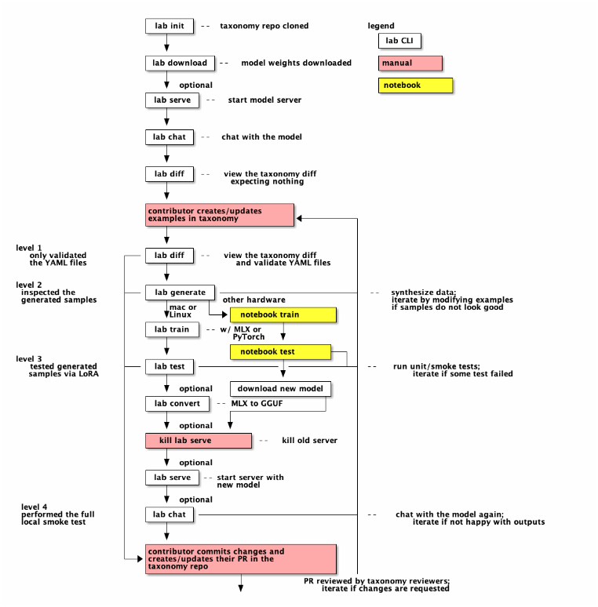

# Labrador 🐶 command-line interface `lab`

Labrador 🐶 is a novel synthetic data-based alignment tuning method for Large
Language Models (LLMs.) The "**lab**" in **Lab**rador 🐶 stands for **L**arge-scale **A**lignment for Chat **B**ots.

This command-line interface for Labrador 🐶 (`lab`) will allow you to create models tuned
with your data using the Labrador 🐶 method on your laptop or workstation.

_`lab` currently **requires an 🍎 Apple M1/M2/M3 Mac** or 🐧 Linux system (tested on Fedora) to use. We anticipate
future support for other operating systems in the future._

## Contents:

- [Labrador 🐶 command-line interface `lab`](#labrador--command-line-interface-lab)
  - [Contents:](#contents)
  - [What is `lab`?](#what-is-lab)
- [Getting `lab`](#getting-lab)
  - [📋 Requirements](#-requirements)
  - [🧰 Installing `lab`](#-installing-lab)
    - [Installing from GitHub (I just want it to use it! 🚀)](#installing-from-github-i-just-want-it-to-use-it-)
    - [Installing from Source (I want to contribute to `lab` CLI! 🛠️)](#installing-from-source-i-want-to-contribute-to-lab-cli-️)
  - [🚀 Verifying `lab` installation](#-verifying-lab-installation)
- [How to use `lab`](#how-to-use-lab)
  - [🏗️ 1. Initial setup](#️-1-initial-setup)
    - [Prepare the CLI's configuration](#prepare-the-clis-configuration)
    - [Download model](#download-model)
  - [🧑‍🏫 2. Running the downloaded model](#-2-running-the-downloaded-model)
    - [Serve the model](#serve-the-model)
    - [Chat with the model](#chat-with-the-model)
    - [Generate a dataset](#generate-a-dataset)
      - [Configuration](#configuration)
    - [Train the model](#train-the-model)
  - [👩🏽‍🔬 3. Testing the fine-tuned model](#-3-testing-the-fine-tuned-model)
    - [Serve the fine-tuned model](#serve-the-fine-tuned-model)
    - [Try out the new model](#try-out-the-new-model)
    - [Run tests](#run-tests)
  - [🎁 4. Submit your dataset!](#-4-submit-your-dataset)
  - [Contributing](#contributing)

## What is `lab`?

`lab` is a Command-Line Interface (CLI) that will minimally allow you to:

1. Download a pretrained LLM from [`lab`'s GitHub repo](https://github.com/open-labrador/cli/releases).
2. Chat with the LLM as-downloaded from GitHub.

`lab`'s most interesting feature, however, is to allow _you_ to **add new knowledge and skills to the pre-trained LLM**.

How is this done? First, you have to add new information to the companion [taxonomy](https://github.com/open-labrador/taxonomy.git) repository. Please read the docs there to see how this can be done.

After you've added some skills or knowledge (when knowledge contributions are accepted) to `taxonomy`, you can:

3. Use `lab` to synthesize a large amount of new training data from your locally-cloned `taxonomy` repository.
4. Re-train the LLM that you initially downloaded with this new training data.

Finally, you can run the retrained model and make use of its new talents!

# Getting `lab`

## 📋 Requirements

- 🐍 Python 3.9 or later (CLang dsitribution of Python: 15.0.0 from xcode)
- 🍎 macOS (14.x with an M1/M2/M3 Metal/GPU) or 🐧 Linux (tested on Fedora)
- 🐱 `gh` cli: Install [Github command cli](https://cli.github.com/) for downloading models from Github (optional if you download the models yourself)

🗒️ **Note:** The steps below use [Python venv](https://docs.python.org/3/library/venv.html) for virtual environments. If you have used [pyenv](https://github.com/pyenv/pyenv),
[Conda Miniforge](https://github.com/conda-forge/miniforge), or another tool for Python version management on your laptop, then use the virtual environment with that tool instead. Otherwise, you may have issues with packages installed but modules
from that package not found as they are linked to your Python version management tool and not `venv`.

## 🧰 Installing `lab`

The `lab` CLI will be available from PyPI using `pip3 install lab-cli` in the future.
For the moment, we'll be installing from GitHub!

### Installing from GitHub (I just want it to use it! 🚀)

Let's start at an example folder `~/Documents/github` on your computer.

We'll create a new directory called `labrador` to store the files that this CLI needs when it runs.

```shell
mkdir labrador
cd labrador
python3 -m venv venv
source venv/bin/activate
pip install git+ssh://git@github.com/open-labrador/cli.git@stable
```

These are the steps that we're executing above, in plain language:

1. Create the new `labrador` directory.
2. `cd` into that directory.
3. In the `labrador` directory, created a new Python virtual environment.
4. Turn the virtual environment on.
5. Install the latest stable tag of labrador cli program from GitHub in the new virtual environment.

**NOTE**: You're free to name the new directory that we called `labrador` anything you want!

### Installing from Source (I want to contribute to `lab` CLI! 🛠️)

Go to the [contributors guide]( CONTRIBUTING/CONTRIBUTING.md ) for more details on contributing to the project.

## 🚀 Verifying `lab` installation

In order for `lab` to run correctly in your terminal (or shell) window, you'll always need the Python virtual environment, where `lab` was installed in to be turned on. You can check if it is enabled as it will show virtual env name (e.g. `venv` ) at the terminal prompt prefix or at the end depending on your shell. If you start a new terminal or its not initialised then run:

```shell
source venv/bin/activate
```

See "Installing" above if you haven't completed that step already!

If `lab` is installed correctly, you should be able to run:

```ShellSession
$ lab
Usage: lab [OPTIONS] COMMAND [ARGS]...

  CLI for interacting with labrador.

  If this is your first time running lab, it's best to start with `lab init`
  to create the environment

Options:
  --config PATH  Path to a configuration file.  [default: config.yaml]
  --help         Show this message and exit.

Commands:
  chat      Run a chat using the modified model
  download  Download the model(s) to train
  generate  Generates synthetic data to enhance your example data
  init      Initializes environment for labrador
  list      Lists taxonomy files that have changed (modified or untracked).
  serve     Start a local server
  submit    Initializes environment for labrador
  test      Perform rudimentary tests of the model
  train     Trains labrador model
```

Congrats! You're ready to get started 😁

# How to use `lab`

**NOTE**: The following instructions assume that you've followed the "Installation" instructions above, including installing `lab` from GitHub into a Python virtual environment.

The Labrador 🐶 CLI `lab` requires a few setup steps. In these instructions, we'll guide you through getting started.
You can see a flow chart showing the order of commands in a typical workflow as well as detailed command documentation below:



## 🏗️ 1. Initial setup

### Prepare the CLI's configuration

- Inside the `labrador` directory that we created in the installation step, run the following:

  ```shell
  lab init
  ```

  This will add a new, default `config.yaml` file, and clone the `git@github.com:open-labrador/taxonomy.git` repository into the `labrador` directory.

### Download model

- `lab` will **automatically** download a pre-trained model from GitHub and store it in the `labrador/models/` directory. (requires [gh](https://cli.github.com/))

```shell
  lab download
```

  It will download all the models from the latest [release](https://github.com/open-labrador/cli/releases) into the local directory.

  Pop over to our [cli releases](https://github.com/open-labrador/cli/releases) to check out the list of available models and a set of instructions on how to do this manually;

  **Note:** Users should make sure they are either logged in to their github accounts via the `gh` CLI (which can be achieved by running `gh auth login` and following the prompts/instructions), or if using macOS, users can add their SSH keys to their apple-keychain by running:
  ```
  ssh-add --apple-use-keychain ~/.ssh/[your-private-key]
  ```

  📋 **Note:** Once you have the model chunks downloaded and reassembled according to the instructions above, please move the model to a `models/` directory in the root directory of your git checkout of this project (this assumes the model is in your `Downloads/` folder):

  The model will come from the latest [release](https://github.com/open-labrador/cli/releases).

- Manually downloading models:

  If you'd like to, you can use a different model, also available on GitHub in [cli releases]( https://github.com/open-labrador/cli/releases/tag/v0.2.0). Instructions for downloading other models manually can be found there.

  📋 **Note:** Once you have the model chunks downloaded and reassembled according to the instructions above, please move the model to a `models/` directory.

  ```shell
  mkdir models
  mv ~/Downloads/ggml-labrador13B-model-Q4_K_M.gguf models
  ```

## 🧑‍🏫 2. Running the downloaded model

---

📋 **Note:** By default, the serve and generate commands assume that we're using `ggml-malachite-7b-0226-Q4_K_M.gguf` - this is a lightweight, fast model based on [Mistral](https://mistral.ai/news/announcing-mistral-7b/) that takes about ~45 min for synthetic data generation on an M1 / 16GB mac. If you have another quantized, gguf-format model you would like to use instead, there is a `--model` argument you can add to the **serve** and **generate** commands to indicate which model to use:

- **Serve** with the `--model` argument requires indicating the directory path to the model file, e.g.:
  `lab serve --model models/ggml-malachite-7b-0226-Q4_K_M.gguf`

- **Generate** with the `--model` argument just requires the file name of the gguf model and assumes the model is located in the `models/` subdirectory of the root `cli/` git checkout directory, e.g.:
  `lab generate --model ggml-malachite-7b-0226-Q4_K_M.gguf`

📋 **Note:** If you're on a less-common configuration, it's possible GPU acceleration won't work out of the box. Advanced users willing to tinker might want to look at [the GPU documentation](docs/gpu-acceleration.md) for tips on how to re-enable GPU acceleration.

---

### Serve the model

- Serve the downloaded model locally via the **serve** command using [llama-cpp-python](https://github.com/abetlen/llama-cpp-python) (which provides Python bindings for the [llama.cpp framework](https://github.com/ggerganov/llama.cpp)):

  ```shell
  lab serve
  ```

  Once the model is being served and ready (takes less than 1 minute on an M1 mac), you'll see the following output:

  ```
  Starting server process
  After application startup complete see http://127.0.0.1:8000/docs for API.
  Press CTRL+C to shutdown server.
  INFO:     Started server process [4295]
  INFO:     Waiting for application startup.
  INFO:     Application startup complete.
  INFO:     Uvicorn running on http://127.0.0.1:8000 (Press CTRL+C to quit)
  ```

### Chat with the model

- Before you start tuning your model and adding new Skills and Knowledge, check out its baseline performance.
  This way, you'll be able to tell whether the model has learned from your contributions!

  **Note:** Because you're serving the model in one terminal window, you'll likely have to create a new window and re-activate your Python virtual environment to run the following command:

  ```shell
  lab chat
  ```

  Once you are in the chat interface, you can type `/h` for help, which will list out all of the chat commands.

### Generate a dataset

- Create a new example skill and contribute it to the existing taxonomy tree. Instructions to do this can be found at https://github.com/open-labrador/taxonomy?tab=readme-ov-file#knowledge-vs-skills under the 'Skills' section
- Generate a synthetic dataset to enhance your example data set using the **generate** command. If you haven't made any changes to your `/taxonomy` directory yet, nothing should happen.

  ```shell
  lab generate
  ```

  **Note:** Make sure you're in a terminal window with your Python virtual environment enabled!

  📋 **Note:** This takes about **~45 minutes** to complete on an M1 mac with 16 GB RAM. The synthetic data set will be three files that are named like: `generated*.json`, `test*.jsonl`, and `train*.jsonl`. The file names will include the model used and date and time of generation.

  #### Configuration

  `lab` will use a default configuration file unless otherwise specified. You can override this behavior with the `--config` parameter.

  ```ShellSession
  lab --config=./config.yml generate
  ```

  **Note:** Make sure to pass the `--config` flag after `lab` and not after `generate`.

### Train the model

Train the model on your synthetic data-enhanced dataset by following the instructions in [Training](./notebooks/README.md)

## 👩🏽‍🔬 3. Testing the fine-tuned model

### Serve the fine-tuned model

- First, stop the server you have running via `ctrl+c` in the terminal it is running in.
- Serve the fine-tuned model locally via the **serve** with the `--model` argument to specify your new model.

  ```shell
  lab serve --model <New model name>
  ```

### Try out the new model

- Try the fine-tuned model out live using a chat interface, and see if the results are better than the untrained version of the model with **chat**:

  ```shell
  lab chat
  ```

  Once you are in the chat interface, you can type `/h` for help, which will list out all of the chat commands.

### Run tests

- Run tests against the model via the **test** command:

  ```shell
  lab test
  ```

## 🎁 4. Submit your dataset!

Of course the final step is - if you've improved the model - to share your new dataset by submitting it! You'll submit it via a pull-request process, which
is documented in the [taxonomy respository](https://github.com/open-labrador/taxonomy).

## Contributing

Check out our [contributing](CONTRIBUTING.md) guide to learn how to contribute to the Labrador CLI.
