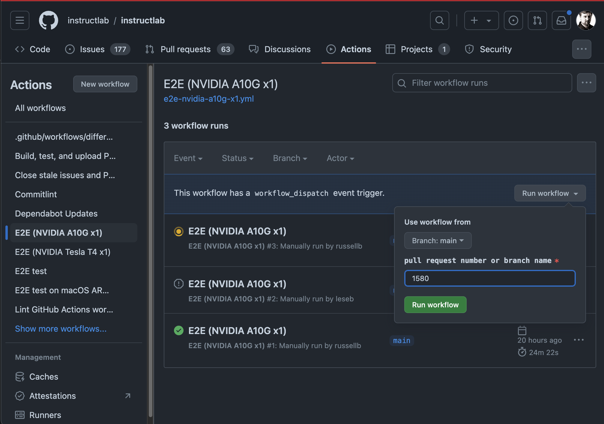

# CI for InstructLab

## Unit tests

All unit tests currently live in the `tests/` directory.

## Functional tests

The functional test script can be found at `scripts/functional-tests.sh`

## End-to-end (E2E) tests

The end-to-end test script can be found at `scripts/basic-workflow-tests.sh`.
This script takes arguments that control which features are used to allow
varying test coverage based on the resources available on a given test runner.

There is currently a [default `E2E`
job](https://github.com/instructlab/instructlab/blob/main/.github/workflows/e2e.yml)
that runs automatically on all PRs and after commits merge to `main` or release
branches.

There are other E2E jobs that can be triggered manually on the [actions
page](https://github.com/instructlab/instructlab/actions) for the repository.
These run on a variety of instance types and can be run at the discretion of
repo maintainers.

### Trigger via GitHub Web UI

For the E2E jobs that are launched manually, they take an input field that
specifies the PR number or git branch to run them against. If you run them
against a PR, they will automatically post a comment to the PR when the tests
begin and end so it's easier for those involved in the PR to follow the results.

1. Visit the [Actions tab](https://github.com/instructlab/instructlab/actions).
2. Click on the [E2E test](https://github.com/instructlab/instructlab/actions/workflows/e2e.yml)
   workflow on the left side of the page.
3. Click on the `Run workflow` button on the right side of the page.
4. Enter a branch name or a PR number in the input field.
5. Click the green `Run workflow` button.

Here is an example of using the GitHub Web UI to launch an E2E workflow:

### Current GPU-enabled Runners

The project currently supports the usage of the following runners for the E2E jobs:

* [GitHub built-in GPU runner](https://docs.github.com/en/actions/using-github-hosted-runners/about-larger-runners/about-larger-runners#specifications-for-gpu-larger-runners) -- referred to as `ubuntu-gpu` in our workflow files Only `e2e.yml` uses this runner.
* Ephemeral GitHub runners launched on demand on AWS. Most workflows work this way, granting us access to a wider variety of infrastructure at lower cost.

### E2E Workflows

| File | Runner Host |Instance Type | GPU Type | OS |
| --- | --- | --- | --- | --- |
| [`e2e.yml`](https://github.com/instructlab/instructlab/blob/main/.github/workflows/e2e.yml) | GitHub | N/A | 1 x NVIDIA Tesla T4 w/ 16 GB VRAM | Ubuntu |
| [`e2e-nvidia-t4-x1.yml`](https://github.com/instructlab/instructlab/blob/main/.github/workflows/e2e-nvidia-t4-x1.yml) | AWS | [`g4dn.2xlarge`](https://aws.amazon.com/ec2/instance-types/g4/) | 1 x NVIDIA Tesla T4 w/ 16 GB VRAM | CentOS Stream 9 |
| [`e2e-nvidia-a10g-x1.yml`](https://github.com/instructlab/instructlab/blob/main/.github/workflows/e2e-nvidia-a10g-x1.yml) | AWS |[`g5.2xlarge`](https://aws.amazon.com/ec2/instance-types/g5/) | 1 x NVIDIA A10G w/ 24 GB VRAM | CentOS Stream 9 |

### E2E Test Matrix

| Area | Feature | [`e2e.yml`](https://github.com/instructlab/instructlab/blob/main/.github/workflows/e2e.yml) | [`e2e-nvidia-t4-x1.yml`](https://github.com/instructlab/instructlab/blob/main/.github/workflows/e2e-nvidia-t4-x1.yml) | [`e2e-nvidia-a10g-x1.yml`](https://github.com/instructlab/instructlab/blob/main/.github/workflows/e2e-nvidia-a10g-x1.yml) |
| --- | --- | --- | --- | --- |
| **Serving**  | llama-cpp                |✅|✅|✅|
|              | vllm                     |❌|❌|❌|
| **Generate** | simple                   |✅|✅|✅|
|              | full                     |❌|❌|❌|
| **Training** | legacy+Linux             |❌|❌|✅|
|              | legacy+Linux+4-bit-quant |✅|✅|❌|
|              | training-lib             |❌|❌|❌|
| **Eval**     | eval                     |❌|❌|❌|
