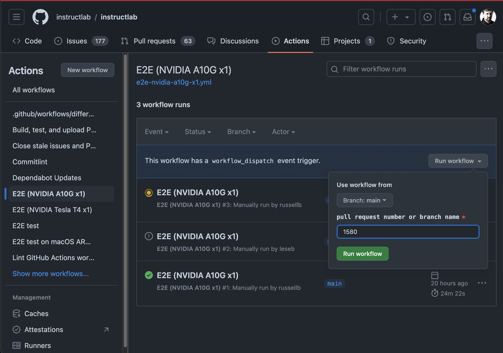

# CI for InstructLab

The InstructLab continuous integration (CI) ecosystem:


## Unit tests

Unit tests validate specific components or features of InstructLab in isolation. InstructLab CI runs these tests on CPU-only Ubuntu runners using Python 3.11.

In general, all code changes should add a new unit test or modify an existing unit test.

Unit tests are stored in the `tests/` directory and are run with [pytest](https://docs.pytest.org/) via [tox](https://tox.wiki/).

## Functional tests

Functional tests validate components or features of InstructLab in tandem, but not necessarily as part of a complex workflow. InstructLab CI runs these tests on CPU-only Ubuntu runners using Python 3.11.

New code may or may not need a functional test. However, contributors should strive to create functional tests where possible.

The functional test script is Shell-based and can be found at `scripts/functional-tests.sh`.

## End-to-end (E2E) tests

There are two E2E test scripts:

`scripts/e2e-ci.sh` - This script tests the InstructLab workflow from end to end, mimicking real user behavior across four "t-shirt sizes" of systems. Most E2E CI jobs use this script.

`scripts/e2e-custom.sh` - This script takes arguments that control which features are used to allow varying test coverage based on the resources available on a given test runner. The ["custom" E2E CI job](https://github.com/instructlab/instructlab/blob/main/.github/workflows/e2e-aws-custom.yml) uses this script. However, you can specify another script such as `e2e-ci.sh` to test changes to a different code path that does not automatically run against a pull request.

The ["small" t-shirt size E2E job](https://github.com/instructlab/instructlab/blob/main/.github/workflows/e2e-nvidia-t4-x1.yml) and ["medium" t-shirt size E2E job](https://github.com/instructlab/instructlab/blob/main/.github/workflows/e2e-nvidia-l4-x1.yml) run automatically on all pull requests and commits merged into the `main` branch and release branches. These jobs depend on the successful completion of any linting jobs.

The ["large" t-shirt size E2E job](https://github.com/instructlab/instructlab/blob/main/.github/workflows/e2e-nvidia-l40s-x4.yml) and ["X-large" t-shirt size E2E job](https://github.com/instructlab/instructlab/blob/main/.github/workflows/e2e-nvidia-l40s-x8.yml) can be [triggered manually on the actions page](#triggering-an-e2e-job-via-the-github-web-user-interface). The "large" t-shirt size E2E job also runs automatically against the `main` branch at 11AM UTC every day.

### E2E Test Coverage Options

When running `e2e-ci.sh`, specify one of the following flags to run the corresponding test and optionally preserve the E2E_TEST_DIR:

| Flag | Feature |
| ---- | --- |
| `s`  | Run the e2e workflow for the small t-shirt size of hardware |
| `m`  | Run the e2e workflow for the medium t-shirt size of hardware |
| `l`  | Run the e2e workflow for the large t-shirt size of hardware |
| `a`  | Run the e2e workflow for the large t-shirt size of hardware on a llama pipeline |
| `x`  | Run the e2e workflow for the X-large t-shirt size of hardware |
| `p`  | Preserve the E2E_TEST_DIR for debugging |

> [!NOTE]
> To perform DK-Bench evaluation, you must set the OPENAI_API_KEY environment variable before running the script.
> This environment variable is set in the CI. However, the script will exit with a warning if the environment variable is not set when running locally.
> If you do not have an OPENAI_API_KEY, set OPENAI_API_KEY='NO_API_KEY' to run the script without running DK-Bench.

When running `e2e-custom.sh`, specify the following flags to test the corresponding features of `ilab`:

| Flag | Feature |
| --- | --- |
| `e` | Run model evaluation |
| `F` | Run "fullsize" SDG |
| `q` | Run the 'simple' training pipeline with 4 bit quantization |
| `s` | Run the 'simple' training pipeline |
| `f` | Use the 'full' training pipeline optimized for CPU and MPS rather than simple training |
| `a` | Use the 'accelerated' training library rather than simple or full training |
| `m` | Run minimal configuration (lower number of instructions and training epochs) |
| `M` | Use Mixtral model (4-bit quantized) instead of Merlinite (4-bit quantized) |
| `P` | Use the phased training within the 'full' training library |
| `v` | Run with vLLM for serving |

### Current E2E Jobs

| Name | T-Shirt Size | Runner Host | Instance Type | OS | GPU Type | Script | Flags | Runs when? | Discord reporting? |
| --- | --- | --- | --- | --- | --- | --- | --- | --- | --- |
| [`e2e-nvidia-t4-x1.yml`](https://github.com/instructlab/instructlab/blob/main/.github/workflows/e2e-nvidia-t4-x1.yml) | Small | AWS | [`g4dn.2xlarge`](https://aws.amazon.com/ec2/instance-types/g4/) | CentOS Stream 9 | 1 x NVIDIA Tesla T4 w/ 16 GB VRAM | `e2e-ci.sh` | `s` | Pull requests, Push to `main` or `release-*` branch | No |
| [`e2e-nvidia-l4-x1.yml`](https://github.com/instructlab/instructlab/blob/main/.github/workflows/e2e-nvidia-l4-x1.yml) | Medium | AWS |[`g6.8xlarge`](https://aws.amazon.com/ec2/instance-types/g5/) | CentOS Stream 9 | 1 x NVIDIA L4 w/ 24 GB VRAM | `e2e-ci.sh` | `m` | Pull requests, Push to `main` or `release-*` branch | No |
| [`e2e-nvidia-l40s-x4.yml`](https://github.com/instructlab/instructlab/blob/main/.github/workflows/e2e-nvidia-l40s-x4.yml) | Large | AWS |[`g6e.12xlarge`](https://aws.amazon.com/ec2/instance-types/g6e/) | CentOS Stream 9 | 4 x NVIDIA L40S w/ 48 GB VRAM (192 GB) | `e2e-ci.sh` | `l` | Manually by Maintainers, Automatically against `main` branch at 11AM UTC | Yes |
| [`e2e-nvidia-l40s-x4-llama.yml`](https://github.com/instructlab/instructlab/blob/main/.github/workflows/`e2e-nvidia-l40s-x4-llama.yml`) | Large | AWS | [`g6e.12xlarge`](https://aws.amazon.com/ec2/instance-types/g6e/) | CentOS Stream 9 | 4 x NVIDIA L40S w/ 48 GB VRAM (192 GB) | `e2e-ci.sh` | `a` | Manually by Maintainers, Automatically against `main` branch at 11AM UTC | Yes |
| [`e2e-nvidia-l40s-x4-py312.yml`](https://github.com/instructlab/instructlab/blob/main/.github/workflows/`e2e-nvidia-l40s-x4-py312.yml`) | Large | AWS | [`g6e.12xlarge`](https://aws.amazon.com/ec2/instance-types/g6e/) | CentOS Stream 9 | 4 x NVIDIA L40S w/ 48 GB VRAM (192 GB) | `e2e-ci.sh` | `a` | Manually by Maintainers, Automatically against `main` branch at 11AM UTC | Yes |
| [`e2e-nvidia-l40s-x4-release.yml`](https://github.com/instructlab/instructlab/blob/main/.github/workflows/`e2e-nvidia-l40s-x4-release.yml`) | Large | AWS | [`g6e.12xlarge`](https://aws.amazon.com/ec2/instance-types/g6e/) | CentOS Stream 9 | 4 x NVIDIA L40S w/ 48 GB VRAM (192 GB) | `e2e-ci.sh` | `a` | Manually by Maintainers, Automatically against `main` branch at 11AM UTC | Yes |
| [`e2e-nvidia-l40s-x8.yml`](https://github.com/instructlab/instructlab/blob/main/.github/workflows/e2e-nvidia-l40s-x8.yml) | X-Large | AWS |[`g6e.48xlarge`](https://aws.amazon.com/ec2/instance-types/g6e/) | CentOS Stream 9 | 8 x NVIDIA L40S w/ 192 GB VRAM (384 GB) | `e2e-ci.sh` | `x` | Manually by Maintainers, Automatically against `main` branch at 11AM UTC | Yes |

### E2E Test Coverage Matrix

| Area | Feature | [`e2e-nvidia-t4-x1.yml`](https://github.com/instructlab/instructlab/blob/main/.github/workflows/e2e-nvidia-t4-x1.yml) | [`e2e-nvidia-l4-x1.yml`](https://github.com/instructlab/instructlab/blob/main/.github/workflows/e2e-nvidia-l4-x1.yml) | [`e2e-nvidia-l40s-x4.yml`](https://github.com/instructlab/instructlab/blob/main/.github/workflows/e2e-nvidia-l40s-x4.yml)(*3) | [`e2e-nvidia-l40s-x8.yml`](https://github.com/instructlab/instructlab/blob/main/.github/workflows/e2e-nvidia-l40s-x8.yml) |
| --- | --- | --- | --- | --- | --- |
| **Serving**  | llama-cpp                 |✅|✅|⎯|⎯|
|              | vllm                      |⎯|✅|✅|✅|
| **Generate** | simple                    |✅|⎯|⎯|⎯|
|              | full                      |⎯|✅|✅|✅|
| **Training** | simple                    |✅(*1)|⎯|⎯|⎯|
|              | full                      |⎯|✅|⎯|⎯|
|              | accelerated (multi-phase) |⎯|⎯|✅|✅|
| **Eval**     | eval                      |⎯|✅(*2)|✅|✅|

Points of clarification (*):

1. The `simple` training pipeline uses 4-bit-quantization. We cannot use the trained model here due to [#579](https://github.com/instructlab/instructlab/issues/579)
2. `MMLU Branch` is not run as the `full` SDG pipeline does not create the needed files in the tasks directory when only training against a skill.
3. Also applies to [`e2e-nvidia-l40s-x4-llama.yml`](https://github.com/instructlab/instructlab/blob/main/.github/workflows/`e2e-nvidia-l40s-x4-llama.yml`), [`e2e-nvidia-l40s-x4-py312.yml`](https://github.com/instructlab/instructlab/blob/main/.github/workflows/`e2e-nvidia-l40s-x4-py312.yml`), and [`e2e-nvidia-l40s-x4-release.yml`](https://github.com/instructlab/instructlab/blob/main/.github/workflows/`e2e-nvidia-l40s-x4-release.yml`).

### Discord reporting

Upon completion, the `Son of Jeeves` bot sends the results of some E2E jobs to the channel `#e2e-ci-results` in Discord. See which jobs currently have reporting via the "Current E2E Jobs" table above.

In Discord, we use [actions/actions-status-discord](https://github.com/sarisia/actions-status-discord) and the built-in channel webhooks feature.

### Triggering an E2E job via the GitHub web user interface

For the E2E jobs that can be launched manually, they take an input field that
specifies the PR number or git branch to run them against. If you run them
against a PR, they will automatically post a comment to the PR when the tests
begin and end so it's easier for those involved in the PR to follow the results.

1. In a web browser, navigate to [Actions](https://github.com/instructlab/instructlab/actions).
2. Click the E2E workflow to run under `Actions`.
3. Click `Run workflow` on the right side of the page.
4. Enter a pull request number or branch name.
5. Click `Run workflow`.

Here is an example of using the GitHub Web user interface to trigger an E2E workflow:



## Dependency on external pull requests

[depends-on-action](https://github.com/marketplace/actions/pr-dependency-management) is activated in the GitHub action workflows. To declare a dependency on an external PR, use the following syntax in the description of your pull request:

```text
Change to use the new library function

Depends-On: https://github.com/org/library/pull/123
```

## Reusable actions

The [`ci-actions`](https://github.com/instructlab/ci-actions) repository contains reusable, in-house GitHub actions specific to the InstructLab organization.

For more information on the actions included and how to integrate them into other jobs, see the [README](https://github.com/instructlab/ci-actions?tab=readme-ov-file#ci-actions) and documentation accompanying each action.
