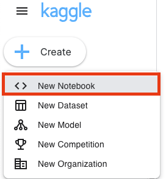
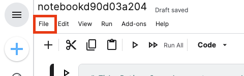
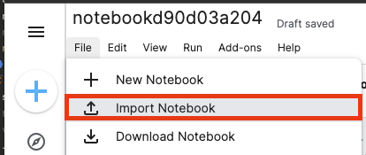
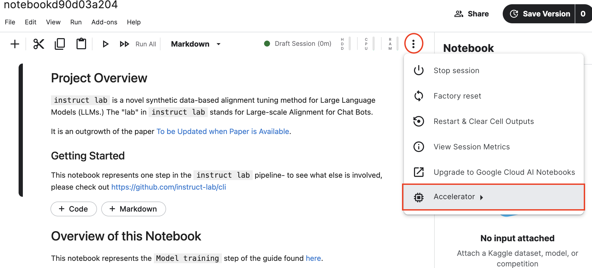
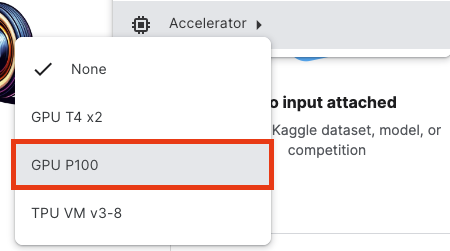
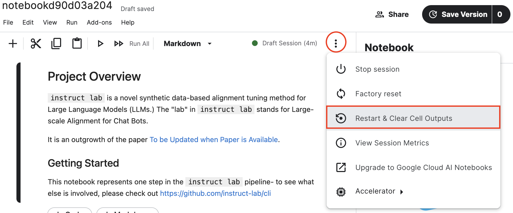

# Training

You're now at the training phase. So far, you have handcrafted some prompts and
responses, and used `ilab data generate` to synthesize those prompt/response pairs
into a new data set.

If you have a Mac Silicon (M1 or newer), we _strongly_ recommend using
`ilab model train` locally, and only proceed here if you hit issues.

Also, there is active work being done to support Linux, so if you have
access to a Linux machine with GPUs, that might also be a better option.

Next, you'll get to fine-tune a LoRA (Low-Rank Adaptation of Large Language
Models) using a Jupyter notebook and (preferably) Google Colab platform or, if
unable to use Colab, unmaintained instructions for
[Kaggle](https://www.kaggle.com).

We've laid out the steps to get started with either platform below.

## Setting up the notebook

### Google Colab

Pre-requisites:

* [Google Colab](https://research.google.com/colaboratory/faq.html)
* A Google account that you're logged into. This will allow you to use Google Colab, which in the free tier will give you access to an NVidia T4 x 15GB GPU.

## Running the notebook

[The notebook](./Training_a_LoRA_With_Instruct_Lab.ipynb) in this folder will walk you through:

1. Uploading the output of `ilab data generate` (a synthetic dataset created based on your hand-written prompts/responses).
2. Checking the base model before training
3. Setting up and training a LoRA. A LoRA uses Parameter-Efficient Fine-Tuning (PEFT) methods to fine-tune a model on a small subset of the overall parameters, allowing you to conduct fine-tuning in a fraction of the time, on a fraction of the hardware required. The resultant model should be updated and better handle your queries than the base model.
4. Inspecting the output model to make sure the LoRA training had the desired effect (i.e. the output has improved).

Once you have finished training and the output looks good, we encourage you go to stage [Testing the fine-tuned model](../README.md#-test-the-newly-trained-model).

### Kaggle (Unsupported and deprecated)

Using a Kaggle Notebook and the NVIDIA P100 provided in the free tier, we will fine tune a LoRA.

#### Pre-requisites

1. You'll need a Kaggle account, which you can create by visiting [Kaggle's Sign-up Page](https://www.kaggle.com/account/login?phase=startRegisterTab&returnUrl=%2F).
1. To use Kaggle's accelerators, you'll have to verify your account with a phone number. Visit the [account settings page](https://www.kaggle.com/settings) and select "Phone Verification".

#### Uploading the notebook

Once you have Kaggle properly configured, you can then run this notebook by following this process:

1. At the top-left of the Kaggle page, click the "Create" button

2. Then, select "Notebook" from the Dropdown menu.

3. This will create a new notebook with some example data inside of it already. From here, select "File" at the top left corner.

4. Then, select "Import notebook". This will prompt you to upload a file from a local disk (you can also use GitHub).

5. With the notebook uploaded, we'll then need to click the three vertical dots on the top right to open the accelerator options.

6. Then select the **P100 GPU Accelerator**. The other accelerator options will not work (yet).

7. Finally, make sure to click "Restart & Clear Cell Outputs" before you run. **_KAGGLE WILL NOT LET YOU RUN NOTEBOOKS OVER 1 MEGABYTE IN SIZE_**

